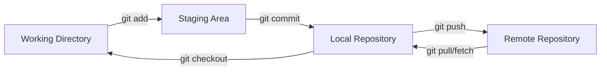
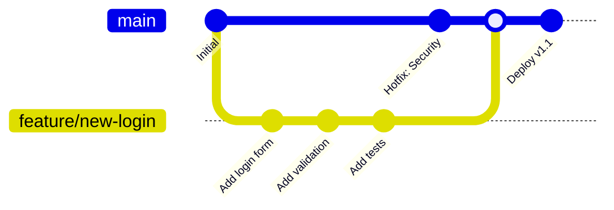
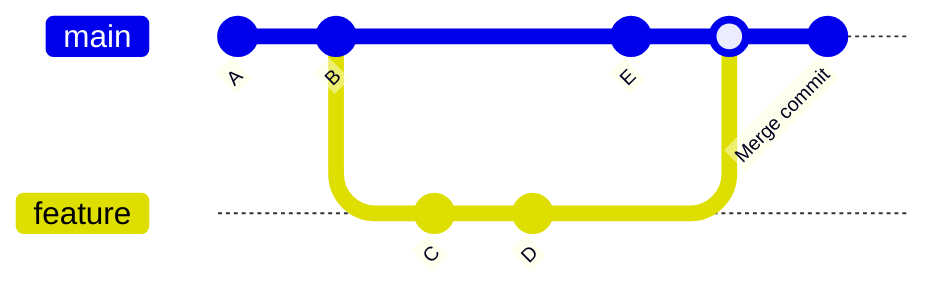
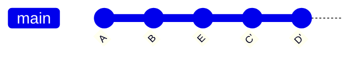
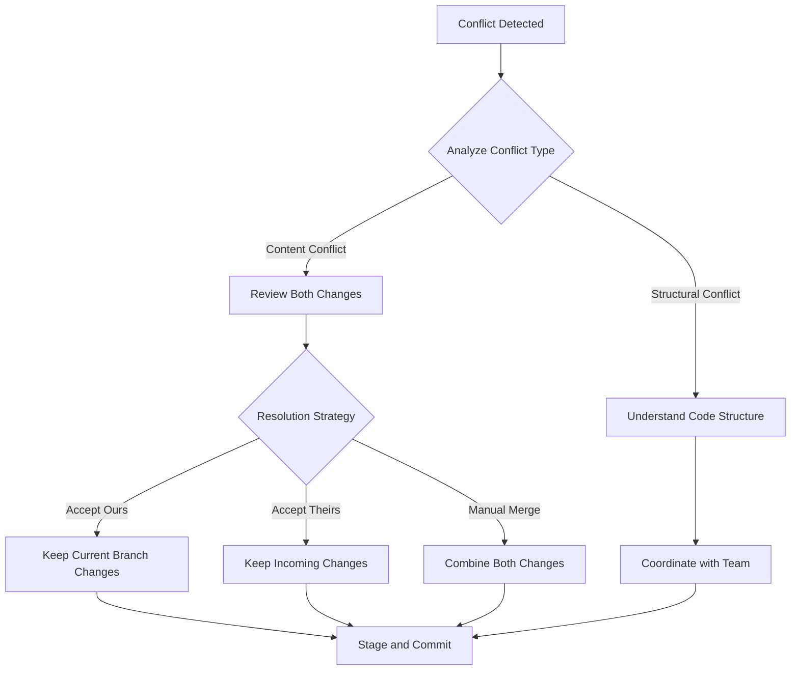
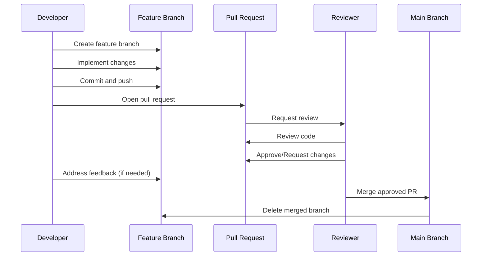
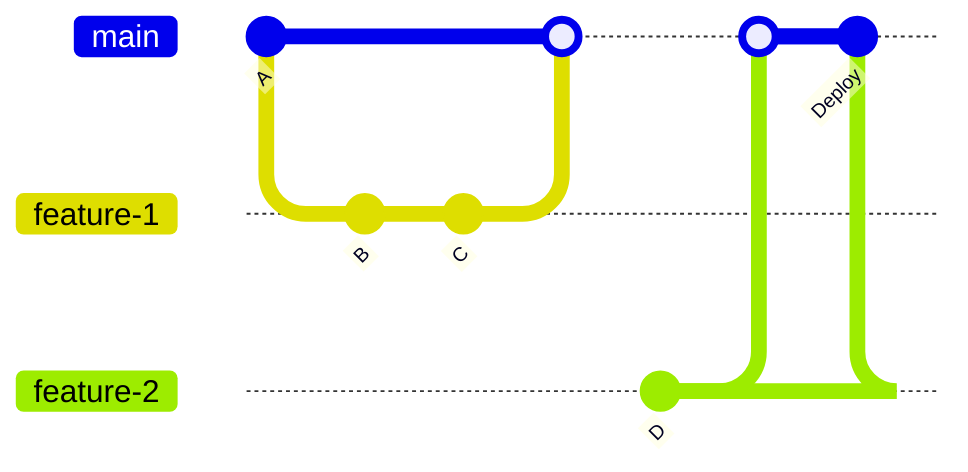
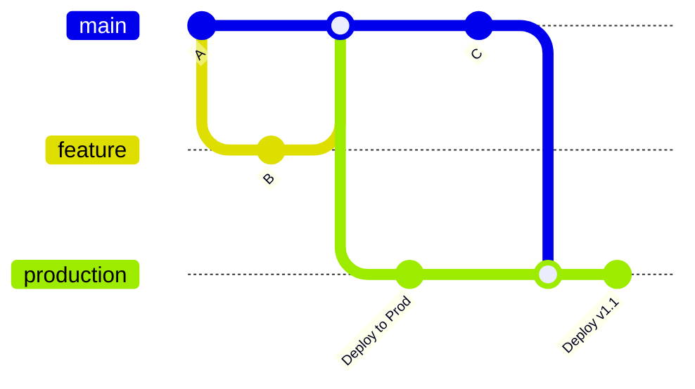
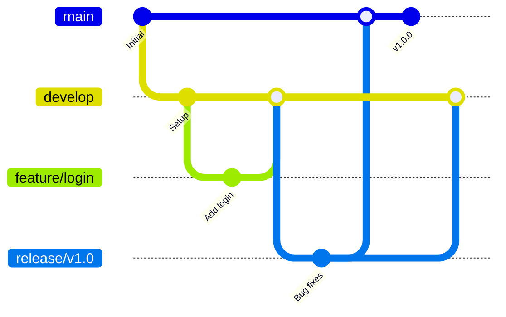
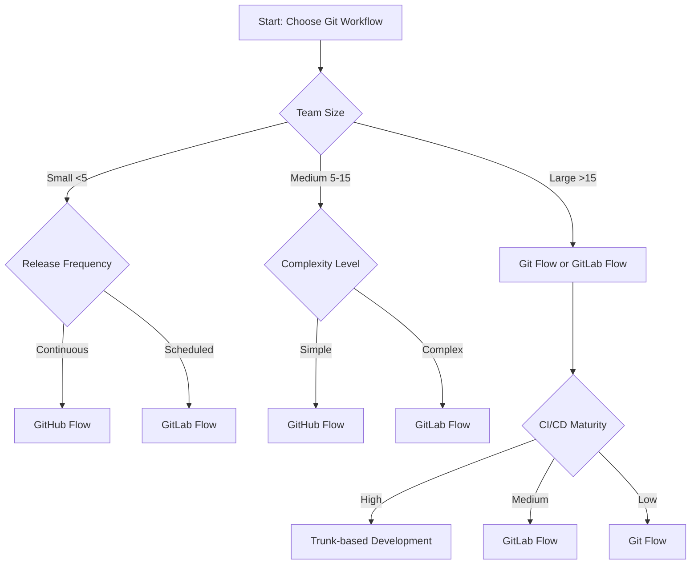

# Advanced Git Workflows - Complete Learning Guide


## Table of Contents

1. [Git Basics & Foundation](#git-basics--foundation)
2. [Feature Branching Strategies](#feature-branching-strategies)
3. [Merge vs Rebase: Deep Dive](#merge-vs-rebase-deep-dive)
4. [Conflict Resolution Mastery](#conflict-resolution-mastery)
5. [Team Collaboration Best Practices](#team-collaboration-best-practices)
6. [Advanced Workflow Patterns](#advanced-workflow-patterns)
7. [Tooling & Automation](#tooling--automation)
8. [Troubleshooting & Common Issues](#troubleshooting--common-issues)

---

## Git Basics & Foundation

### Core Git Concepts

Git is a distributed version control system that tracks changes in files and coordinates work among multiple developers. Understanding these fundamental concepts is crucial:

**Key Components:**
- **Repository**: A folder containing all project files and their complete history
- **Commits**: Snapshots of your code at specific points in time
- **Branches**: Separate lines of development within your project
- **Staging Area**: A preparation area for changes before committing
- **Working Directory**: Your local file system where you make changes

### Essential Git Configuration

```bash
# Set up your identity
git config --global user.name "Your Name"
git config --global user.email "your.email@example.com"

# View current configuration
git config --list

# Set default branch name
git config --global init.defaultBranch main

# Enable colored output
git config --global color.ui auto
```

### The Git Workflow Lifecycle



---

## Feature Branching Strategies

### Branch Naming Conventions

Consistent naming improves team collaboration and project organization:

| Branch Type | Naming Pattern | Example |
|-------------|---------------|---------|
| Feature | `feature/description` | `feature/user-authentication` |
| Bug Fix | `fix/description` | `fix/login-error` |
| Hotfix | `hotfix/description` | `hotfix/security-patch` |
| Release | `release/version` | `release/v1.2.0` |
| Chore | `chore/description` | `chore/update-dependencies` |

### Branch Lifecycle Management



### Creating and Managing Feature Branches

```bash
# Create and switch to new feature branch
git checkout -b feature/user-dashboard

# Make changes and commit
git add .
git commit -m "feat: add user dashboard component"

# Push branch to remote
git push -u origin feature/user-dashboard

# Switch back to main branch
git checkout main

# Delete local branch after merge
git branch -d feature/user-dashboard

# Delete remote branch
git push origin --delete feature/user-dashboard
```

---

## Merge vs Rebase: Deep Dive

### Understanding the Fundamental Difference

**Merge** preserves history as it happened, while **rebase** rewrites history by replaying commits on top of another branch.

### Git Merge: Preserving History



**Merge Characteristics:**
- Creates a merge commit that combines both histories
- Preserves the complete development context
- Shows when branches diverged and merged
- Non-destructive operation
- Ideal for collaboration and audit trails

```bash
# Merge feature branch into main
git checkout main
git merge feature-branch

# Create merge commit even for fast-forward
git merge --no-ff feature-branch

# Abort merge if conflicts arise
git merge --abort
```

### Git Rebase: Rewriting History



**Rebase Characteristics:**
- Creates a linear project history
- Rewrites commit SHA hashes
- Eliminates unnecessary merge commits
- Makes history easier to follow
- Ideal for clean, private branch development

```bash
# Rebase current branch onto main
git rebase main

# Interactive rebase for commit editing
git rebase -i HEAD~3

# Continue rebase after resolving conflicts
git rebase --continue

# Abort rebase if needed
git rebase --abort
```

### Decision Matrix: When to Use Each

| Scenario | Merge | Rebase | Reasoning |
|----------|-------|--------|-----------|
| Public/shared branches | ✅ | ❌ | Preserve collaboration history |
| Private feature branches | ⚠️ | ✅ | Clean linear history |
| Complex feature integration | ✅ | ❌ | Maintain development context |
| Preparing for pull request | ❌ | ✅ | Clean up commit history |
| Team collaboration | ✅ | ⚠️ | Avoid breaking others' work |
| Continuous integration | ✅ | ✅ | Both work with proper practices |

### Interactive Rebase: Advanced History Editing

```bash
# Start interactive rebase
git rebase -i HEAD~4

# Available commands in interactive mode:
# pick - use commit as-is
# reword - change commit message
# edit - modify commit content
# squash - combine with previous commit
# drop - remove commit entirely
```

Example interactive rebase session:
```
pick 1234567 Add user model
squash 2345678 Fix typo in user model
reword 3456789 Add user validation
drop 4567890 Temporary debug code
```

---

## Conflict Resolution Mastery

### Understanding Merge Conflicts

Conflicts arise when two separate branches have made edits to the same line in a file, or when a file has been deleted in one branch but edited in the other.

### Anatomy of a Conflict

```
<<<<<<< HEAD (Current Branch)
const userName = "current_user";
=======
const userName = "feature_user";
>>>>>>> feature-branch (Incoming Branch)
```

**Conflict Markers Explained:**
- `<<<<<<< HEAD`: Start of current branch changes
- `=======`: Separator between conflicting changes
- `>>>>>>> branch-name`: End of incoming branch changes

### Conflict Resolution Strategies



### Step-by-Step Conflict Resolution

1. **Identify Conflicted Files**
```bash
git status
# Shows files with conflicts under "Unmerged paths"
```

2. **Open and Examine Conflicts**
```bash
# View conflict details
git diff

# Open file in editor
code conflicted-file.js
```

3. **Resolve Conflicts Manually**
- Remove conflict markers (`<<<<<<<`, `=======`, `>>>>>>>`)
- Choose which changes to keep
- Test the resolution
- Save the file

4. **Stage and Complete Resolution**
```bash
# Stage resolved files
git add resolved-file.js

# Complete the merge
git commit -m "resolve: merge conflicts in user authentication"
```

### Advanced Conflict Resolution Tools

| Tool | Description | Usage |
|------|-------------|-------|
| `git mergetool` | Launch visual merge tool | `git mergetool` |
| VS Code | Built-in merge conflict UI | Automatic detection |
| KDiff3 | Cross-platform merge tool | `git config merge.tool kdiff3` |
| Beyond Compare | Commercial diff/merge tool | Configure via git config |

### Preventing Conflicts

**Proactive Strategies:**
1. **Frequent Communication**: Coordinate with team members on overlapping work
2. **Small, Frequent Commits**: Easier to identify and resolve conflicts
3. **Regular Branch Updates**: Keep feature branches up-to-date with main
4. **Code Formatting Standards**: Use automated formatters to avoid style conflicts
5. **Modular Code Design**: Reduce likelihood of editing same files

```bash
# Keep feature branch updated
git checkout feature-branch
git fetch origin
git rebase origin/main

# Or use merge approach
git merge origin/main
```

---

## Team Collaboration Best Practices

### Collaborative Workflow Principles

The golden rule for collaborative work should be: "Always be branching, and always be pulling."

### Pull Request/Merge Request Workflow



### Code Review Best Practices

**For Authors:**
- Write clear, descriptive commit messages
- Keep pull requests focused and reasonably sized
- Include tests and documentation
- Respond promptly to feedback
- Use draft PRs for work-in-progress collaboration

**For Reviewers:**
- Provide constructive, specific feedback
- Focus on code quality, not coding style preferences
- Explain the reasoning behind suggestions
- Approve when ready, don't be overly nitpicky
- Review promptly to avoid blocking others

### Commit Message Standards

Follow the conventional commit format for clarity and consistency:

```
<type>(<scope>): <description>

[optional body]

[optional footer]
```

**Commit Types:**
- `feat`: New features
- `fix`: Bug fixes
- `docs`: Documentation changes
- `style`: Code formatting changes
- `refactor`: Code refactoring
- `test`: Adding or modifying tests
- `chore`: Build process or auxiliary tool changes

**Examples:**
```bash
git commit -m "feat(auth): add OAuth2 authentication"
git commit -m "fix(api): resolve timeout issues in user service"
git commit -m "docs: update deployment instructions"
```

### Branch Protection Rules

Implement these protection rules on your main branch:

| Rule | Purpose | Configuration |
|------|---------|---------------|
| Require PR reviews | Ensure code quality | Minimum 1-2 reviewers |
| Require status checks | Automated testing | CI/CD pipeline success |
| Require up-to-date branches | Prevent integration issues | Force update before merge |
| Restrict who can push | Maintain branch integrity | Admin/maintainer only |
| Require signed commits | Security and authenticity | GPG signature verification |

---

## Advanced Workflow Patterns

### Workflow Strategy Comparison

| Strategy | Complexity | Team Size | Release Cycle | Best For |
|----------|------------|-----------|---------------|----------|
| **GitHub Flow** | Low | Small | Continuous | Web apps, open source |
| **GitLab Flow** | Medium | Medium | Continuous/Scheduled | Mixed environments |
| **Git Flow** | High | Large | Scheduled | Enterprise, complex releases |
| **Trunk-based** | Low | Any | Continuous | CI/CD, experienced teams |

### GitHub Flow: Simplicity First



**GitHub Flow Principles:**
1. `main` branch is always deployable
2. Create descriptively named branches for new work
3. Commit frequently to your branch
4. Open pull request for feedback
5. Merge after review and approval
6. Deploy immediately after merge

### GitLab Flow: Environment Bridges



**GitLab Flow Features:**
- Environment-specific branches (staging, production)
- Release branches for versioned releases
- Issue tracking integration
- Upstream first development

### Git Flow: Structured Releases



**Git Flow Branches:**
- `main`: Production-ready code
- `develop`: Integration branch for features
- `feature/*`: New feature development
- `release/*`: Prepare production releases
- `hotfix/*`: Critical production fixes

### Trunk-Based Development: Continuous Integration

Trunk-based development requires developers to integrate their changes into a shared trunk at least once a day, with the trunk always ready for release.

```mermaid
gitGraph
    commit id: "A"
    commit id: "B"
    commit id: "C"
    branch release/v1.0
    checkout trunk
    commit id: "D"
    commit id: "E"
    checkout release/v1.0
    commit id: "Hotfix"
    checkout trunk
    commit id: "F"
```

**Key Characteristics:**
- Single shared branch (trunk/main)
- Short-lived feature branches (<24 hours)
- Frequent integration (daily or more)
- Feature flags for incomplete features
- Strong CI/CD pipeline requirement

---

## Tooling & Automation

### Git Hooks for Automation

Git hooks automate tasks at specific points in the Git workflow:

**Pre-commit Hook Example:**
```bash
#!/bin/sh
# .git/hooks/pre-commit

# Run tests before commit
npm test
if [ $? -ne 0 ]; then
    echo "Tests failed! Commit aborted."
    exit 1
fi

# Format code
npm run format
git add -A
```

**Common Hook Types:**
- `pre-commit`: Run before creating commit
- `commit-msg`: Validate commit messages
- `pre-push`: Run before pushing to remote
- `post-receive`: Server-side hook after receiving push

### CI/CD Integration

**GitHub Actions Example:**
```yaml
name: CI/CD Pipeline
on:
  pull_request:
    branches: [main]
  push:
    branches: [main]

jobs:
  test:
    runs-on: ubuntu-latest
    steps:
      - uses: actions/checkout@v3
      - name: Setup Node.js
        uses: actions/setup-node@v3
        with:
          node-version: '18'
      - name: Install dependencies
        run: npm ci
      - name: Run tests
        run: npm test
      - name: Run linting
        run: npm run lint
```

### Git Aliases for Productivity

Add these aliases to your `.gitconfig`:

```ini
[alias]
    st = status
    co = checkout
    br = branch
    ci = commit
    unstage = reset HEAD --
    last = log -1 HEAD
    visual = !gitk
    tree = log --graph --pretty=format:'%Cred%h%Creset -%C(yellow)%d%Creset %s %Cgreen(%cr) %C(bold blue)<%an>%Creset' --abbrev-commit
    amend = commit --amend --no-edit
    force-push = push --force-with-lease
```

### Recommended Tools

| Category | Tool | Purpose |
|----------|------|---------|
| **GUI Clients** | GitKraken, SourceTree | Visual Git operations |
| **IDE Integration** | VS Code, IntelliJ | Built-in Git support |
| **Merge Tools** | KDiff3, Beyond Compare | Visual conflict resolution |
| **CLI Enhancement** | Oh My Zsh, Git Bash | Enhanced command line |
| **Documentation** | GitBook, Confluence | Workflow documentation |

---

## Troubleshooting & Common Issues

### Common Git Problems and Solutions

**Problem: Accidentally committed to wrong branch**
```bash
# Move last commit to correct branch
git checkout correct-branch
git cherry-pick wrong-branch
git checkout wrong-branch
git reset --hard HEAD~1
```

**Problem: Need to undo last commit but keep changes**
```bash
# Soft reset keeps changes staged
git reset --soft HEAD~1

# Mixed reset keeps changes unstaged
git reset HEAD~1
```

**Problem: Accidentally pushed sensitive data**
```bash
# Remove file from history (use with caution)
git filter-branch --force --index-filter \
'git rm --cached --ignore-unmatch sensitive-file.txt' \
--prune-empty --tag-name-filter cat -- --all

# Force push to update remote
git push --force --all
```

**Problem: Merge conflict in binary files**
```bash
# Choose version from specific branch
git checkout --ours binary-file.png    # Keep your version
git checkout --theirs binary-file.png  # Keep their version
git add binary-file.png
git commit
```

### Recovery Strategies

**Find lost commits with reflog:**
```bash
# View recent HEAD movements
git reflog

# Restore lost commit
git checkout <commit-hash>
git branch recovery-branch
```

**Recover deleted branch:**
```bash
# Find the last commit of deleted branch
git reflog --grep="branch-name"

# Recreate branch from commit
git checkout -b recovered-branch <commit-hash>
```

### Performance Optimization

**Large Repository Management:**
```bash
# Shallow clone for faster downloads
git clone --depth 1 <repository-url>

# Cleanup and optimize repository
git gc --aggressive --prune=now

# Remove untracked files and directories
git clean -fd
```

**Git LFS for Large Files:**
```bash
# Initialize Git LFS
git lfs install

# Track large file types
git lfs track "*.psd"
git lfs track "*.zip"

# Add .gitattributes to repository
git add .gitattributes
```

---

## Workflow Decision Framework

### Choosing the Right Strategy

Use this decision tree to select the optimal Git workflow for your team:



### Implementation Checklist

**Before Starting:**
- [ ] Define branch naming conventions
- [ ] Set up branch protection rules
- [ ] Configure CI/CD pipeline
- [ ] Create workflow documentation
- [ ] Train team members
- [ ] Set up code review process

**During Implementation:**
- [ ] Monitor workflow effectiveness
- [ ] Gather team feedback
- [ ] Adjust rules as needed
- [ ] Document lessons learned
- [ ] Celebrate successes
- [ ] Address pain points quickly

**Continuous Improvement:**
- [ ] Regular workflow retrospectives
- [ ] Metrics tracking (cycle time, merge rate)
- [ ] Tool evaluation and updates
- [ ] Process refinement
- [ ] Knowledge sharing sessions
- [ ] Stay updated with best practices

---

## Conclusion and Next Steps

Mastering Git workflows is an ongoing journey that requires practice, patience, and continuous learning. The key principles to remember:

1. **Start Simple**: Begin with basic workflows and evolve as your team grows
2. **Be Consistent**: Establish clear conventions and stick to them
3. **Communicate Effectively**: Keep your team informed about changes and decisions
4. **Automate When Possible**: Use tools and hooks to reduce manual errors
5. **Learn from Mistakes**: Every conflict and issue is a learning opportunity
6. **Stay Flexible**: Be ready to adapt your workflow as needs change

### Additional Resources

- **Official Git Documentation**: [git-scm.com](https://git-scm.com)
- **Pro Git Book**: Comprehensive guide to Git
- **Atlassian Git Tutorials**: Practical examples and workflows
- **GitHub Learning Lab**: Interactive Git courses
- **GitLab Workflow Documentation**: GitLab-specific best practices

### Practice Exercises

1. Set up a practice repository and experiment with different merge strategies
2. Create conflicts intentionally and practice resolution techniques
3. Implement a complete feature using your chosen workflow
4. Set up automated testing with Git hooks
5. Practice interactive rebase to clean up commit history

Remember: The best Git workflow is the one that your team can execute consistently and that supports your project's goals. Start with proven patterns, but don't be afraid to customize them for your specific needs.

---

*This guide is a living document. Keep it updated as your team's practices evolve and new Git features become available.*