# Complete Cloud Platforms Guide: AWS, Azure, and GCP for DevOps

## Table of Contents
1. [Introduction to Cloud Platforms](#introduction-to-cloud-platforms)
2. [Cloud Platforms Overview](#cloud-platforms-overview)
3. [Billing and Cost Optimization Strategies](#billing-and-cost-optimization-strategies)
4. [Cloud-Native Applications](#cloud-native-applications)
5. [AWS Core Services Deep Dive](#aws-core-services-deep-dive)
6. [Serverless Computing](#serverless-computing)
7. [Use Cases and Deployment Scenarios](#use-cases-and-deployment-scenarios)
8. [Best Practices and Recommendations](#best-practices-and-recommendations)

---

## Introduction to Cloud Platforms

Cloud computing has revolutionized how organizations build, deploy, and scale applications. The three major cloud providers—**Amazon Web Services (AWS)**, **Microsoft Azure**, and **Google Cloud Platform (GCP)**—dominate the market with a combined 65% market share as of 2025.

### Why Cloud Computing Matters

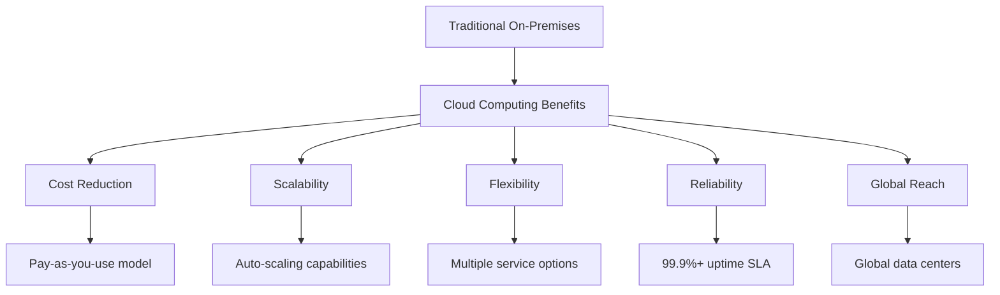

### Market Share (2025)

| Provider | Market Share | Revenue Growth (YoY) | Primary Strengths |
|----------|-------------|---------------------|-------------------|
| **AWS** | 31% | 17% | Largest service catalog, enterprise adoption |
| **Azure** | 25% | 28% | Microsoft ecosystem, hybrid cloud |
| **GCP** | 11% | 29% | AI/ML, data analytics, developer experience |

---

## Cloud Platforms Overview

### Amazon Web Services (AWS)

**Founded:** 2006 | **Services:** 250+ | **Regions:** 32 globally

**Key Strengths:**
- Mature platform with the largest service catalog
- Strong enterprise and government adoption
- Comprehensive compliance certifications
- Robust partner ecosystem

**Core Services:**
- **Compute:** EC2, Lambda, ECS, EKS
- **Storage:** S3, EBS, EFS
- **Database:** RDS, DynamoDB, Aurora
- **Networking:** VPC, CloudFront, Route 53

### Microsoft Azure

**Founded:** 2010 | **Services:** 200+ | **Regions:** 60+ globally

**Key Strengths:**
- Deep integration with Microsoft ecosystem
- Strong hybrid cloud capabilities
- Enterprise-focused solutions
- Competitive AI and ML services

**Core Services:**
- **Compute:** Virtual Machines, Azure Functions, AKS
- **Storage:** Blob Storage, Azure Files
- **Database:** Azure SQL, Cosmos DB
- **Networking:** Virtual Network, Azure CDN

### Google Cloud Platform (GCP)

**Founded:** 2011 | **Services:** 100+ | **Regions:** 40+ globally

**Key Strengths:**
- Superior AI/ML and data analytics
- Developer-friendly experience
- Innovative container and Kubernetes services
- Competitive pricing with automatic discounts

**Core Services:**
- **Compute:** Compute Engine, Cloud Functions, GKE
- **Storage:** Cloud Storage, Persistent Disk
- **Database:** Cloud SQL, Firestore, BigQuery
- **Networking:** VPC, Cloud CDN

### Platform Comparison Matrix

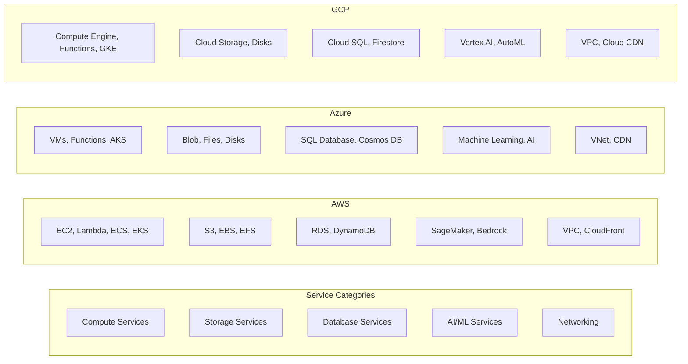

---

## Billing and Cost Optimization Strategies

### Understanding Cloud Pricing Models

#### AWS Pricing Models

| Model | Description | Use Case | Savings |
|-------|-------------|----------|---------|
| **On-Demand** | Pay-per-use, no commitment | Variable workloads, testing | Baseline cost |
| **Reserved Instances** | 1-3 year commitment | Predictable workloads | Up to 72% |
| **Spot Instances** | Excess capacity bidding | Fault-tolerant workloads | Up to 90% |
| **Savings Plans** | Flexible commitment | Mixed workload types | Up to 66% |

#### Azure Pricing Models

| Model | Description | Use Case | Savings |
|-------|-------------|----------|---------|
| **Pay-as-you-go** | Per-minute billing | Variable workloads | Baseline cost |
| **Reserved Instances** | 1-3 year commitment | Steady-state workloads | Up to 82% |
| **Azure Hybrid Benefit** | License portability | Existing Microsoft licenses | Up to 40% |
| **Dev/Test Pricing** | Reduced rates | Development environments | Up to 40% |

#### GCP Pricing Models

| Model | Description | Use Case | Savings |
|-------|-------------|----------|---------|
| **Pay-as-you-go** | Per-second billing | Variable workloads | Baseline cost |
| **Committed Use** | 1-3 year commitment | Predictable workloads | Up to 57% |
| **Sustained Use** | Automatic discounts | Consistent usage | Up to 30% |
| **Preemptible VMs** | Short-lived instances | Batch processing | Up to 80% |

### Cost Optimization Strategies

```mermaid
graph TD
    A[Cost Optimization Strategy] --> B[Right-sizing Resources]
    A --> C[Resource Management]
    A --> D[Storage Optimization]
    A --> E[Network Optimization]
    A --> F[Monitoring & Automation]
    
    B --> B1[Monitor CPU/Memory usage]
    B --> B2[Use appropriate instance types]
    B --> B3[Implement auto-scaling]
    
    C --> C1[Clean up idle resources]
    C --> C2[Schedule dev/test resources]
    C --> C3[Use spot/preemptible instances]
    
    D --> D1[Implement lifecycle policies]
    D --> D2[Use appropriate storage tiers]
    D --> D3[Compress and archive old data]
    
    E --> E1[Optimize data transfer]
    E --> E2[Use CDN for content delivery]
    E --> E3[Implement caching strategies]
    
    F --> F1[Set up cost alerts]
    F --> F2[Use cost management tools]
    F --> F3[Regular cost reviews]
```

### Platform-Specific Cost Optimization Tools

#### AWS Cost Management Tools

1. **AWS Cost Explorer** - Analyze spending patterns
2. **AWS Budgets** - Set cost and usage budgets
3. **AWS Trusted Advisor** - Recommendations for optimization
4. **AWS Compute Optimizer** - Right-sizing recommendations
5. **AWS Cost Anomaly Detection** - Detect unusual spending

#### Azure Cost Management Tools

1. **Azure Cost Management + Billing** - Comprehensive cost analysis
2. **Azure Advisor** - Optimization recommendations
3. **Azure Budgets** - Budget tracking and alerts
4. **Azure Cost Alerts** - Proactive cost monitoring

#### GCP Cost Management Tools

1. **Cloud Billing** - Detailed cost breakdown
2. **Recommender** - AI-driven optimization suggestions
3. **Budget Alerts** - Spending notifications
4. **Committed Use Discounts** - Automatic cost optimization

### Best Practices for Cost Optimization

1. **Implement Tagging Strategy**
   - Tag all resources for cost allocation
   - Use consistent naming conventions
   - Enable detailed billing reports

2. **Regular Resource Auditing**
   - Weekly review of running resources
   - Monthly cost analysis meetings
   - Quarterly architecture reviews

3. **Automation and Policies**
   - Auto-shutdown for development environments
   - Automated scaling policies
   - Budget enforcement mechanisms

---

## Cloud-Native Applications

### What are Cloud-Native Applications?

Cloud-native applications are designed specifically to leverage cloud computing frameworks. They are built using containers, microservices, and serverless functions, enabling scalability, resilience, and rapid deployment.

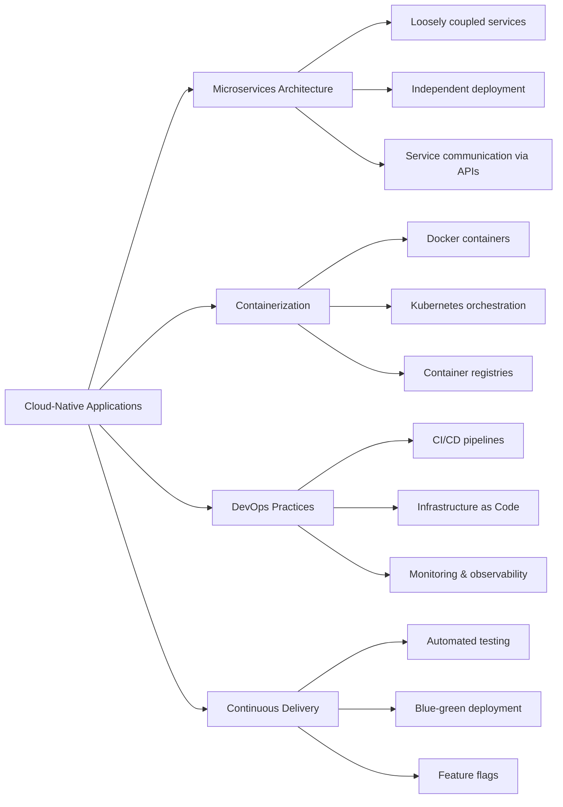

### Container Technology Overview

#### What are Containers?

Containers package applications with their dependencies, ensuring consistency across environments. They share the host OS kernel, making them lightweight compared to virtual machines.

**Container vs VM Comparison:**

| Aspect | Containers | Virtual Machines |
|--------|------------|------------------|
| **Resource Usage** | Lightweight, minimal overhead | Heavy, full OS overhead |
| **Startup Time** | Seconds | Minutes |
| **Isolation** | Process-level | Hardware-level |
| **Portability** | High | Medium |
| **Density** | High (100s per host) | Low (10s per host) |

### Kubernetes: Container Orchestration

Kubernetes (K8s) is the de facto standard for container orchestration, originally developed by Google and now maintained by the Cloud Native Computing Foundation (CNCF).

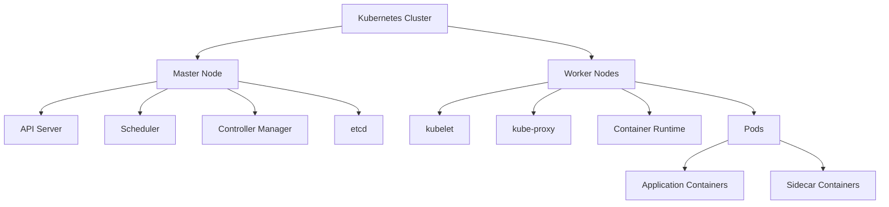

#### Key Kubernetes Concepts

1. **Pods** - Smallest deployable unit containing one or more containers
2. **Services** - Network endpoints for accessing pods
3. **Deployments** - Declarative updates for pods and replica sets
4. **ConfigMaps** - Configuration data for applications
5. **Secrets** - Sensitive data like passwords and API keys
6. **Ingress** - External access to services within the cluster

### Cloud-Native Application Architecture

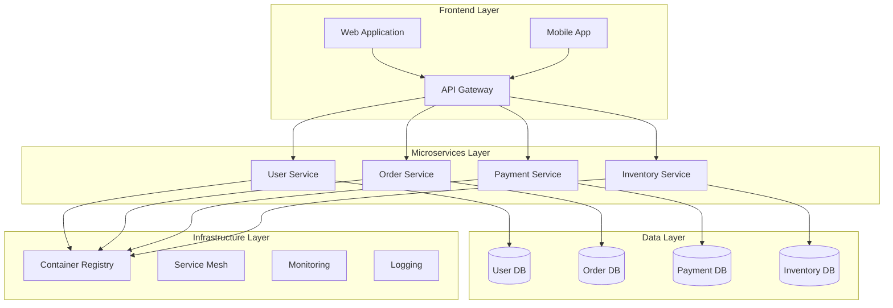

### Deployment Strategies

#### Blue-Green Deployment

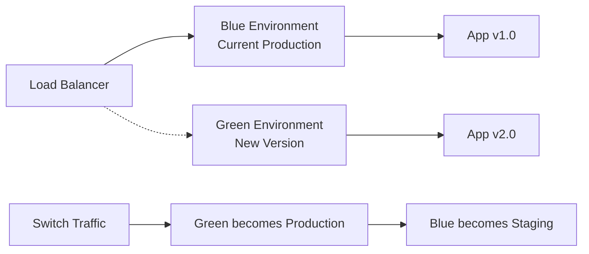

#### Canary Deployment

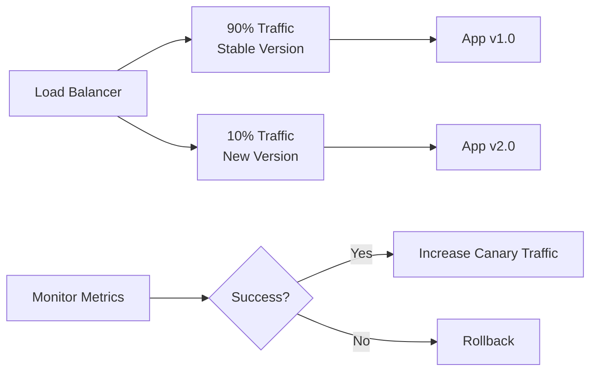

---

## AWS Core Services Deep Dive

### Amazon Virtual Private Cloud (VPC)

VPC enables you to launch AWS resources in a logically isolated virtual network that you define.

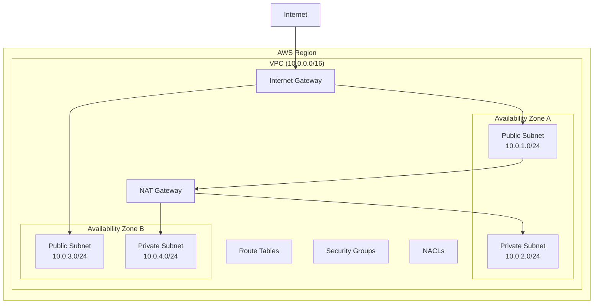

#### VPC Components

| Component | Description | Use Case |
|-----------|-------------|----------|
| **Subnets** | Logical subdivision of VPC | Separate public/private resources |
| **Internet Gateway** | Gateway to the internet | Enable internet access |
| **NAT Gateway** | Network Address Translation | Outbound internet for private subnets |
| **Route Tables** | Traffic routing rules | Control network traffic flow |
| **Security Groups** | Instance-level firewall | Stateful traffic filtering |
| **NACLs** | Subnet-level firewall | Stateless traffic filtering |

### Amazon Elastic Kubernetes Service (EKS)

EKS is a managed Kubernetes service that makes it easy to run Kubernetes on AWS.

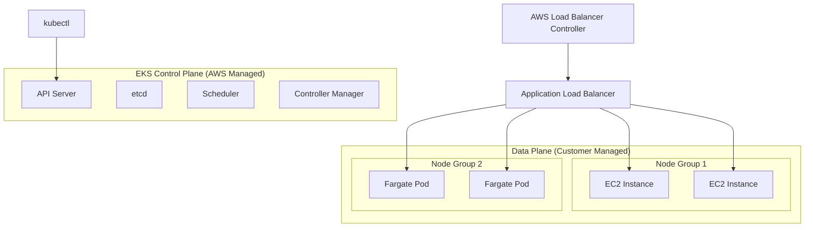

#### EKS Features

1. **Managed Control Plane** - AWS manages the Kubernetes control plane
2. **Multi-AZ Deployment** - High availability across availability zones
3. **Integration with AWS Services** - Native integration with ELB, IAM, VPC
4. **Fargate Support** - Serverless container execution
5. **Node Groups** - Managed groups of EC2 instances
6. **Add-ons** - AWS-managed cluster add-ons

### Amazon S3 (Simple Storage Service)

S3 is object storage service that offers industry-leading scalability, data availability, security, and performance.

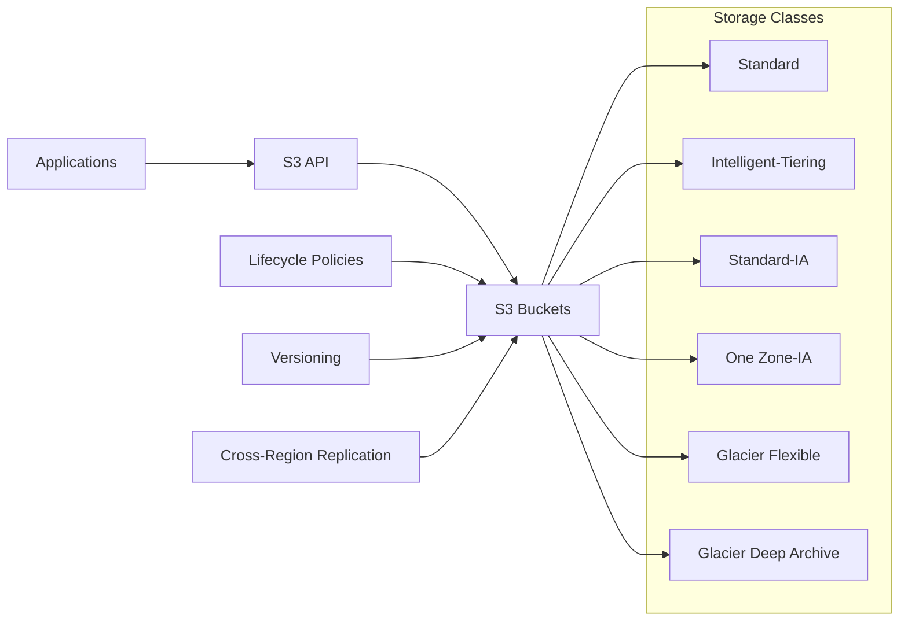

#### S3 Storage Classes Comparison

| Storage Class | Use Case | Availability | Min Storage Duration | Retrieval Time |
|---------------|----------|--------------|---------------------|----------------|
| **Standard** | Frequently accessed | 99.999999999% (11 9's) | None | Immediate |
| **Standard-IA** | Infrequently accessed | 99.999999999% | 30 days | Immediate |
| **One Zone-IA** | Less critical data | 99.999999999% | 30 days | Immediate |
| **Glacier Flexible** | Long-term archive | 99.999999999% | 90 days | 1-5 minutes |
| **Glacier Deep Archive** | Rarely accessed | 99.999999999% | 180 days | 12 hours |

### Amazon CloudFront

CloudFront is a content delivery network (CDN) service that accelerates delivery of websites, APIs, video content, and other web assets.

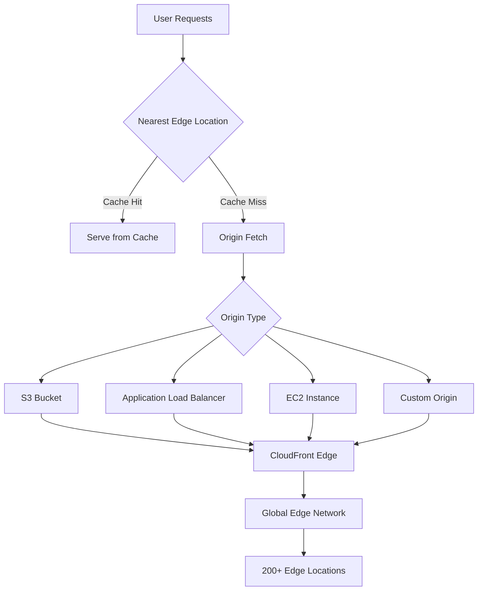

#### CloudFront Features

1. **Global Edge Network** - 200+ edge locations worldwide
2. **Origin Types** - S3, ALB, EC2, custom origins, VPC origins
3. **Caching Strategies** - TTL, cache behaviors, invalidation
4. **Security** - AWS WAF integration, DDoS protection
5. **SSL/TLS** - Free SSL certificates via ACM
6. **Real-time Metrics** - CloudWatch integration

---

## Serverless Computing

### What is Serverless?

Serverless computing allows you to run code without provisioning or managing servers. You pay only for the compute time consumed, with automatic scaling from zero to peak demand.

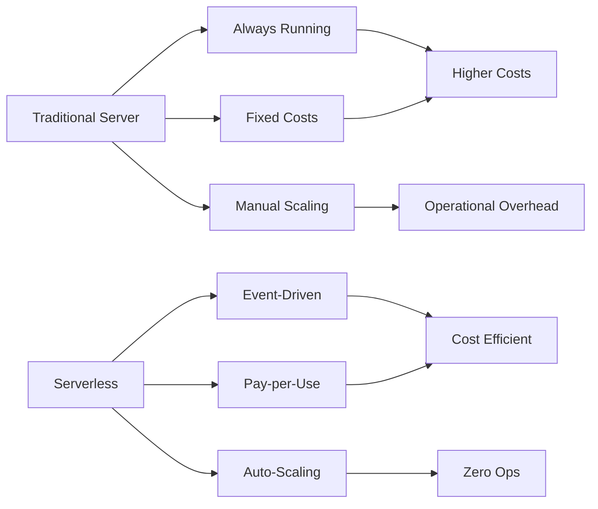

### AWS Lambda

AWS Lambda is a serverless computing service that runs your code in response to events and automatically manages the compute resources.

#### Lambda Architecture

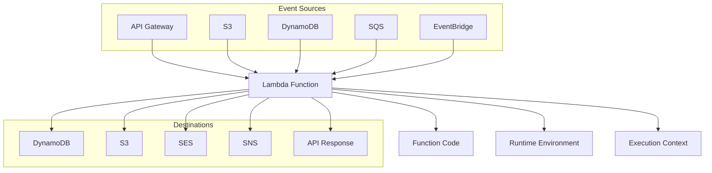

#### Lambda Features

| Feature | Description | Benefit |
|---------|-------------|---------|
| **Event-Driven** | Triggered by AWS services | Reactive architecture |
| **Auto-Scaling** | Scales from 0 to 1000s | No capacity planning |
| **Pay-per-Request** | Charge per invocation | Cost optimization |
| **Multiple Languages** | Python, Node.js, Java, etc. | Developer flexibility |
| **VPC Support** | Access private resources | Security compliance |
| **Layers** | Shared code libraries | Code reusability |

#### Lambda Use Cases

1. **Real-time File Processing** - Process uploads to S3
2. **Data Transformation** - ETL operations
3. **API Backends** - Serverless REST APIs
4. **Event Processing** - React to database changes
5. **Scheduled Tasks** - Cron-like functionality
6. **Stream Processing** - Process Kinesis streams

### Azure Functions

Azure Functions is Microsoft's serverless compute service that enables event-driven programming.

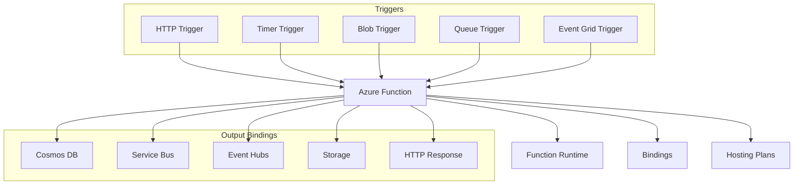

#### Azure Functions Hosting Plans

| Plan | Description | Scaling | Use Case |
|------|-------------|---------|----------|
| **Consumption** | Pay-per-execution | Automatic | Variable workloads |
| **Premium** | Pre-warmed instances | Automatic | Consistent performance |
| **Dedicated** | App Service plan | Manual | Predictable costs |
| **Container Apps** | Container-based | Automatic | Custom runtimes |

#### Azure Functions Features

1. **Multiple Languages** - C#, JavaScript, Python, Java, PowerShell
2. **Flexible Triggers** - HTTP, timers, storage events, message queues
3. **Bindings** - Declarative connections to Azure services
4. **Durable Functions** - Stateful functions for workflows
5. **KEDA Integration** - Kubernetes-based event-driven autoscaling

### Serverless vs Traditional Architecture

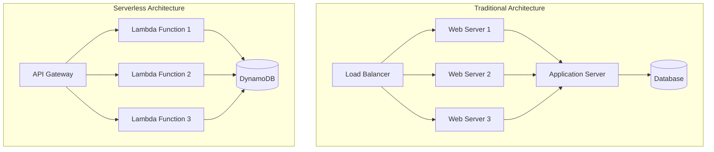

### Serverless Best Practices

1. **Keep Functions Small** - Single responsibility principle
2. **Optimize Cold Starts** - Minimize initialization time
3. **Use Environment Variables** - Configuration management
4. **Implement Proper Error Handling** - Retry logic and dead letter queues
5. **Monitor and Log** - Comprehensive observability
6. **Secure Functions** - Least privilege access

---

## Use Cases and Deployment Scenarios

### Common Cloud Deployment Patterns

#### 1. Web Application Deployment

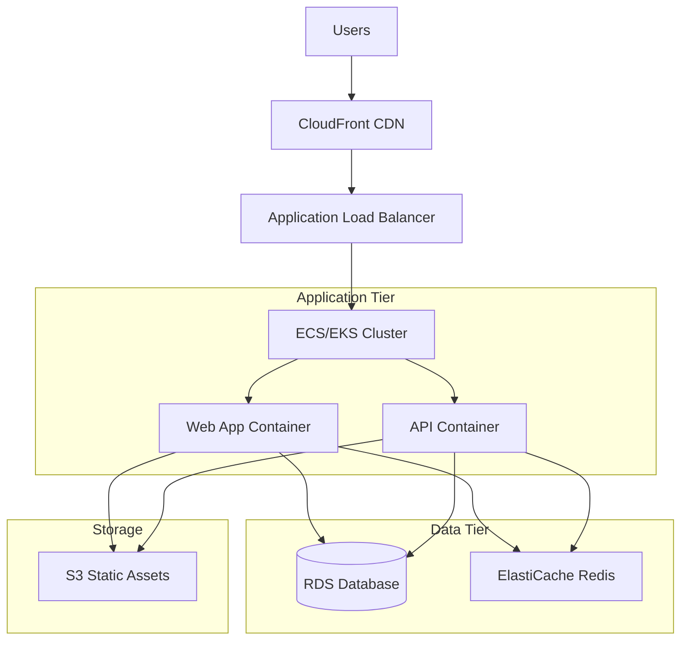

**Use Case:** E-commerce platform with high availability and scalability requirements.

**Components:**
- **CloudFront** - Global content delivery
- **ALB** - Load distribution and SSL termination
- **ECS/EKS** - Container orchestration
- **RDS** - Managed relational database
- **ElastiCache** - In-memory caching
- **S3** - Static asset storage

#### 2. Data Analytics Pipeline

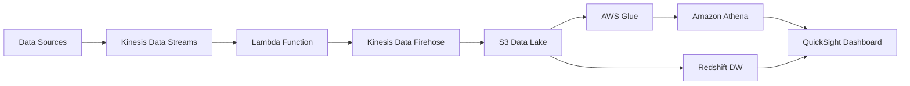

**Use Case:** Real-time analytics for IoT sensor data processing.

**Components:**
- **Kinesis** - Real-time data streaming
- **Lambda** - Data transformation
- **S3** - Data lake storage
- **Glue** - ETL service
- **Athena** - Serverless queries
- **QuickSight** - Data visualization

#### 3. Microservices Architecture

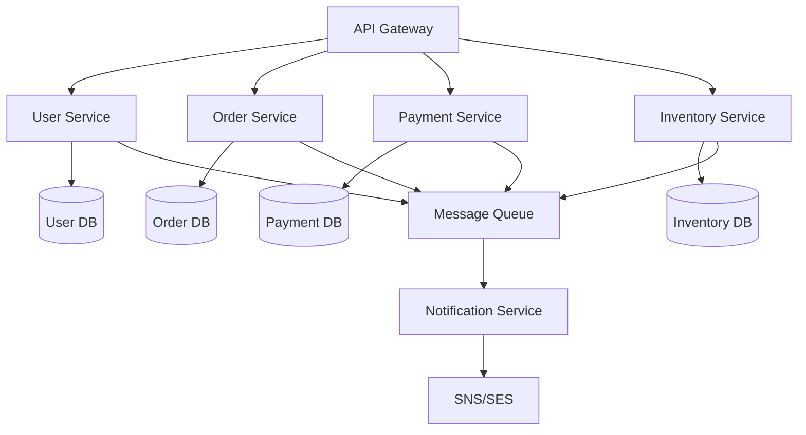

**Use Case:** Scalable e-commerce backend with loosely coupled services.

**Benefits:**
- Independent scaling
- Technology diversity
- Fault isolation
- Team autonomy

#### 4. Serverless API Backend

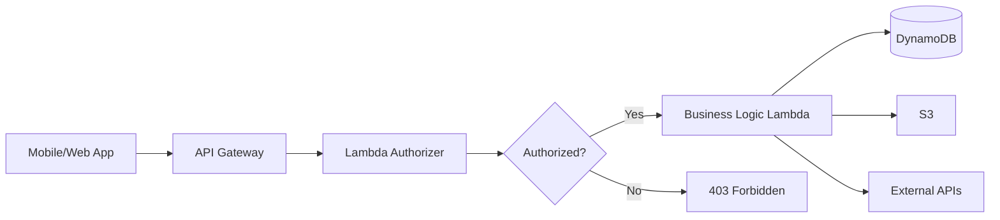

**Use Case:** Mobile app backend with user authentication and data processing.

**Advantages:**
- No server management
- Automatic scaling
- Pay-per-request pricing
- Built-in security features

### Multi-Cloud and Hybrid Strategies

#### Multi-Cloud Benefits

```mermaid
graph TB
    A[Multi-Cloud Strategy] --> B[Avoid Vendor Lock-in]
    A --> C[Best-of-Breed Services]
    A --> D[Geographic Coverage]
    A --> E[Risk Mitigation]
    A --> F[Cost Optimization]
    
    B --> G[Flexibility in negotiations]
    C --> H[Use AWS for X, Azure for Y]
    D --> I[Local compliance requirements]
    E --> J[Disaster recovery]
    F --> K[Leverage pricing differences]
```

#### Hybrid Cloud Scenarios

1. **Cloud Bursting** - Handle peak loads in the cloud
2. **Data Residency** - Keep sensitive data on-premises
3. **Legacy Integration** - Gradual cloud migration
4. **Disaster Recovery** - Cloud as backup site

### Industry-Specific Use Cases

#### Healthcare
- **HIPAA Compliance** - Encrypted storage and transmission
- **Medical Imaging** - High-performance computing for analysis
- **Telemedicine** - Real-time video streaming platforms

#### Financial Services
- **Regulatory Compliance** - SOC 2, PCI DSS requirements
- **High-Frequency Trading** - Low-latency computing
- **Risk Analysis** - Big data processing and ML

#### Retail
- **Seasonal Scaling** - Handle Black Friday traffic spikes
- **Recommendation Engines** - ML-powered personalization
- **Supply Chain** - IoT and real-time tracking

#### Manufacturing
- **IoT Sensors** - Equipment monitoring and predictive maintenance
- **Digital Twins** - Virtual representations of physical assets
- **Quality Control** - AI-powered defect detection

---

## Best Practices and Recommendations

### Security Best Practices

#### Identity and Access Management (IAM)

```mermaid
graph TB
    A[IAM Best Practices] --> B[Principle of Least Privilege]
    A --> C[Multi-Factor Authentication]
    A --> D[Regular Access Reviews]
    A --> E[Service-to-Service Authentication]
    
    B --> F[Grant minimum required permissions]
    C --> G[Enable MFA for all users]
    D --> H[Quarterly permission audits]
    E --> I[Use service accounts/roles]
```

#### Security Checklist

- [ ] Enable MFA for all user accounts
- [ ] Use IAM roles instead of access keys
- [ ] Implement network segmentation with VPCs
- [ ] Enable logging and monitoring
- [ ] Encrypt data at rest and in transit
- [ ] Regular security assessments
- [ ] Implement backup and disaster recovery
- [ ] Use Web Application Firewall (WAF)

### Monitoring and Observability

#### The Three Pillars of Observability

```mermaid
graph LR
    A[Observability] --> B[Metrics]
    A --> C[Logs]
    A --> D[Traces]
    
    B --> E[System Performance]
    B --> F[Business KPIs]
    
    C --> G[Application Logs]
    C --> H[System Logs]
    C --> I[Audit Logs]
    
    D --> J[Request Flow]
    D --> K[Performance Bottlenecks]
    D --> L[Error Analysis]
```

#### Monitoring Tools by Platform

| Platform | Native Tools | Third-Party Options |
|----------|-------------|-------------------|
| **AWS** | CloudWatch, X-Ray, AWS Config | Datadog, New Relic, Splunk |
| **Azure** | Azure Monitor, Application Insights | Dynatrace, AppDynamics |
| **GCP** | Cloud Monitoring, Cloud Trace | Prometheus, Grafana |

### DevOps and CI/CD Integration

#### CI/CD Pipeline for Cloud Applications

```mermaid
graph LR
    A[Source Code] --> B[Version Control]
    B --> C[Build Stage]
    C --> D[Test Stage]
    D --> E[Security Scan]
    E --> F[Deploy to Staging]
    F --> G[Integration Tests]
    G --> H[Deploy to Production]
    H --> I[Monitor & Alert]
```

#### Infrastructure as Code (IaC)

**Benefits:**
- Version controlled infrastructure
- Consistent environments
- Automated deployments
- Easy rollbacks

**Popular Tools:**
- **Terraform** - Multi-cloud support
- **AWS CloudFormation** - AWS native
- **Azure ARM Templates** - Azure native
- **Google Cloud Deployment Manager** - GCP native
- **Pulumi** - Programming language approach

### Performance Optimization

#### Application Performance Tips

1. **Caching Strategy**
   - Use CDN for static content
   - Implement application-level caching
   - Database query optimization

2. **Database Optimization**
   - Read replicas for read-heavy workloads
   - Connection pooling
   - Query optimization and indexing

3. **Network Optimization**
   - Use regional deployments
   - Optimize data transfer
   - Implement compression

4. **Container Optimization**
   - Minimize image size
   - Use multi-stage builds
   - Optimize resource requests/limits

### Disaster Recovery and Business Continuity

#### RTO vs RPO

```mermaid
graph LR
    A[Disaster Occurs] --> B[Recovery Point<br/>Objective (RPO)]
    A --> C[Recovery Time<br/>Objective (RTO)]
    
    B --> D[How much data<br/>loss is acceptable?]
    C --> E[How quickly must<br/>systems be restored?]
    
    D --> F[Backup Frequency]
    E --> G[Recovery Strategy]
```

#### DR Strategies

| Strategy | RTO | RPO | Cost | Complexity |
|----------|-----|-----|------|------------|
| **Backup & Restore** | Hours | Hours | Low | Low |
| **Pilot Light** | 10-30 min | Minutes | Medium | Medium |
| **Warm Standby** | 5-10 min | Minutes | High | Medium |
| **Multi-Site Active** | <1 min | Seconds | Very High | High |

### Cost Management Best Practices

#### Cost Optimization Checklist

- [ ] Regular cost reviews and analysis
- [ ] Implement resource tagging strategy
- [ ] Use appropriate instance types and sizes
- [ ] Leverage reserved capacity for predictable workloads
- [ ] Implement auto-scaling policies
- [ ] Clean up unused resources regularly
- [ ] Use lifecycle policies for storage
- [ ] Monitor and optimize data transfer costs
- [ ] Implement budget alerts and controls
- [ ] Regular architecture reviews for optimization

---

## Conclusion

This comprehensive guide covers the fundamental concepts and practical applications of major cloud platforms. As you continue your DevOps journey, remember that cloud technologies are constantly evolving. Stay updated with:

- **Official documentation** from AWS, Azure, and GCP
- **Certification programs** to validate your skills
- **Community forums** and user groups
- **Hands-on practice** with free tier accounts
- **Regular architecture reviews** to optimize costs and performance

### Next Steps

1. **Choose a platform** to start with based on your organization's needs
2. **Set up a free account** and explore basic services
3. **Complete hands-on tutorials** for core services
4. **Build a sample project** using the concepts learned
5. **Consider certification paths** to formalize your knowledge
6. **Join community groups** and stay updated with best practices

### Additional Resources

- [AWS Well-Architected Framework](https://aws.amazon.com/architecture/well-architected/)
- [Azure Architecture Center](https://docs.microsoft.com/en-us/azure/architecture/)
- [Google Cloud Architecture Center](https://cloud.google.com/architecture)
- [Cloud Native Computing Foundation](https://www.cncf.io/)
- [Kubernetes Documentation](https://kubernetes.io/docs/)

---

*This guide serves as a comprehensive starting point for your cloud journey. The cloud landscape is vast and constantly evolving, so continuous learning and hands-on practice are essential for mastering these technologies.*