# Deep Dive into Azure: Complete Beginner's Guide

## Table of Contents
1. [Introduction to Cloud Computing](#1-introduction-to-cloud-computing)
2. [What is Microsoft Azure?](#2-what-is-microsoft-azure)
3. [Azure Global Infrastructure](#3-azure-global-infrastructure)
4. [Core Azure Services](#4-core-azure-services)
5. [Azure Resource Management](#5-azure-resource-management)
6. [Azure Networking Fundamentals](#6-azure-networking-fundamentals)
7. [Azure Security & Identity](#7-azure-security--identity)
8. [Azure Pricing & Cost Management](#8-azure-pricing--cost-management)
9. [Getting Started - Hands-on](#9-getting-started---hands-on)
10. [DevOps with Azure](#10-devops-with-azure)
11. [Best Practices](#11-best-practices)
12. [Certification Path](#12-certification-path)

---

## 1. Introduction to Cloud Computing

### What is Cloud Computing? 🌥️

**Simple Analogy**: Think of cloud computing like **electricity in your home**. You don't need to own a power plant to get electricity - you just plug into the electrical grid and pay for what you use. Similarly, cloud computing lets you use computing resources (servers, storage, databases) over the internet without owning the physical hardware.

### Key Benefits

| Traditional IT | Cloud Computing |
|----------------|----------------|
| Buy servers upfront | Pay as you use |
| Maintain hardware | Provider maintains |
| Limited scaling | Scale instantly |
| Fixed location | Access anywhere |

### Cloud Service Models

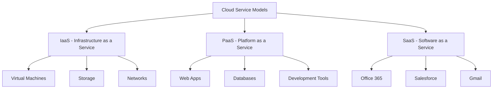

#### IaaS (Infrastructure as a Service)
**Analogy**: Like renting a car - you get the vehicle (server) but you're responsible for driving it, maintaining it, and adding fuel.
- **What you manage**: Operating System, Applications, Runtime, Data
- **What cloud provides**: Servers, Storage, Networking, Virtualization

#### PaaS (Platform as a Service)  
**Analogy**: Like taking a taxi - the driver handles the car, traffic, and navigation. You just focus on getting to your destination.
- **What you manage**: Applications and Data only
- **What cloud provides**: Everything else (OS, Runtime, etc.)

#### SaaS (Software as a Service)
**Analogy**: Like using Netflix - you just enjoy the content, everything else is handled for you.
- **What you manage**: Just your data and user settings
- **What cloud provides**: Complete application

### Cloud Deployment Models

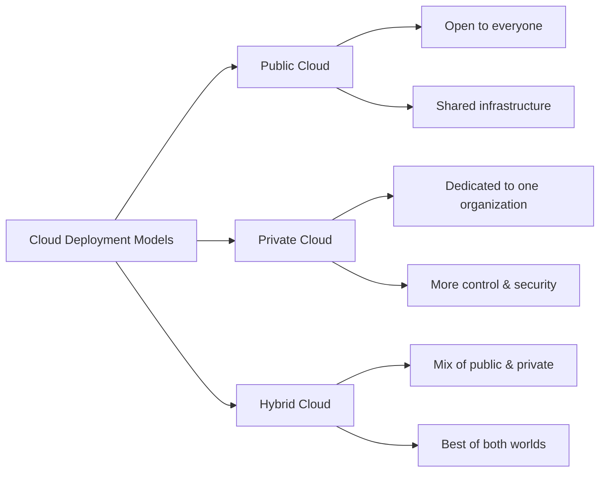

---

## 2. What is Microsoft Azure?

### Definition
Microsoft Azure is a cloud computing platform with an ever-expanding set of services to help you build solutions to meet your business goals. It provides software as a service (SaaS), platform as a service (PaaS), and infrastructure as a service (IaaS) and supports many different programming languages, tools, and frameworks.

**Simple Analogy**: Think of Azure as a **giant digital shopping mall** where instead of buying clothes or food, you rent computing services. Each "store" in this mall offers different services - some rent computers, others provide databases, and some offer tools to build mobile apps.

### Why Choose Azure?

#### 1. **Global Presence** 🌍
Azure provides over 70 regions globally, more than any other cloud provider, ensuring your applications are close to your users worldwide.

#### 2. **Hybrid Capabilities** 🔄
Azure provides hybrid consistency in application development, management and security, identity management, and across the data platform.

#### 3. **Integrated Environment** 🛠️
Works seamlessly with Microsoft tools you might already know (Windows, Office, Visual Studio).

### Azure's Market Position

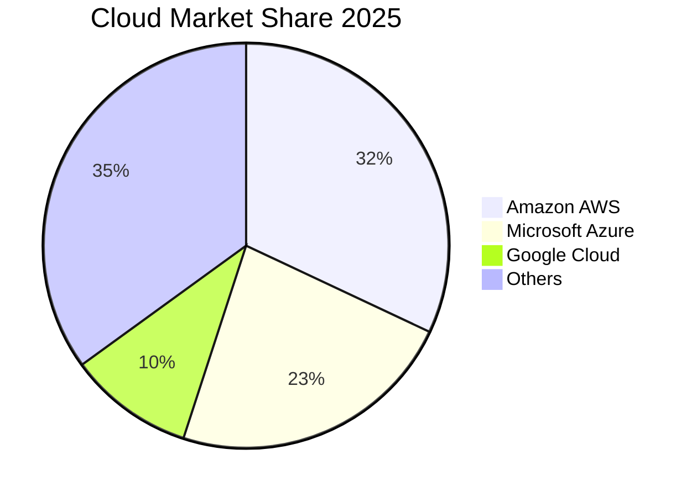

### Key Azure Characteristics

| Feature | Description | Analogy |
|---------|-------------|---------|
| **Scalability** | Grow or shrink resources instantly | Like a rubber band - stretch when needed |
| **Reliability** | 99.9%+ uptime guarantees | Like a 24/7 convenience store |
| **Security** | Enterprise-grade protection | Like a bank vault for your data |
| **Global** | Available worldwide | Like McDonald's - everywhere you go |

---

## 3. Azure Global Infrastructure

### Understanding Azure's Physical World

**Analogy**: Think of Azure's infrastructure like a **global postal system**. You have countries (Geographies), states/provinces (Regions), cities (Availability Zones), and post offices (Data Centers).

### Infrastructure Hierarchy

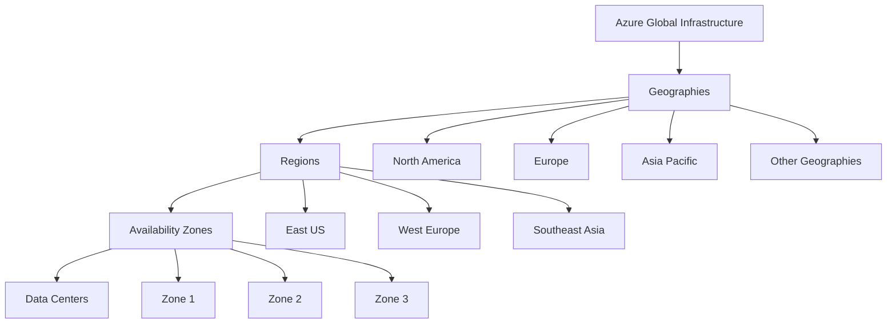

### 1. Geographies
**What**: Large areas defined by data residency and compliance boundaries
**Analogy**: Like countries with their own laws and regulations
**Examples**: United States, Europe, Asia Pacific
**Why Important**: Ensures your data stays within legal boundaries

### 2. Regions
Each region is a set of physical facilities that include datacenters and networking infrastructure

**What**: Specific locations within a geography
**Analogy**: Like major cities in a country
**Examples**: East US, West Europe, Southeast Asia
**Key Facts**:
- Azure has 60+ regions globally
- Each region contains multiple data centers
- Regions are connected by high-speed networks

#### Region Selection Criteria

| Factor | Consider | Example |
|--------|----------|---------|
| **Latency** | Closer = Faster | Choose region near your users |
| **Services** | Not all services everywhere | Some AI services only in certain regions |
| **Cost** | Prices vary by region | US regions often cheaper than EU |
| **Compliance** | Legal requirements | EU data must stay in EU |

### 3. Availability Zones
Availability zones are separated groups of datacenters within a region. Each availability zone has independent power, cooling, and networking infrastructure

**Analogy**: Like having multiple bank branches in the same city - if one has problems, others keep working.

**Key Features**:
- Typically separated by several kilometers, usually within 100 kilometers
- Latency perimeter of less than two milliseconds between availability zones
- Independent power, cooling, and networking

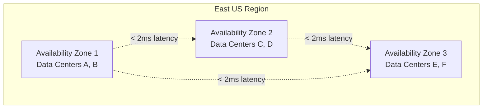

### 4. Data Centers
**What**: Physical buildings containing servers
**Analogy**: Like warehouses full of computers
**Reality**: Massive facilities with thousands of servers, backup power, cooling systems

### Disaster Recovery Strategy

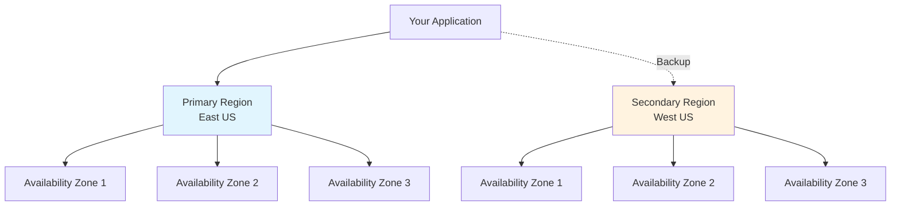

---

## 4. Core Azure Services

### The Azure Service Menu 🍽️

**Analogy**: Azure services are like a restaurant menu with different categories - appetizers (basic services), main courses (core services), desserts (advanced services), and beverages (support services).

### Service Categories Overview

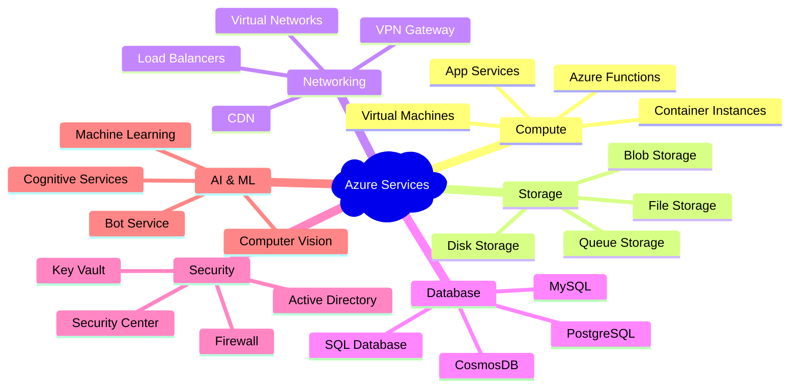

### 1. Compute Services 💻

**What**: Services that run your applications and code
**Analogy**: Like different types of restaurants - fast food (Functions), casual dining (App Service), fine dining (Virtual Machines)

#### Virtual Machines (VMs)
**What**: Complete computers in the cloud
**Analogy**: Like renting a fully furnished apartment - you get everything and control it completely
**Use Cases**: 
- Migrating existing applications to cloud
- Full control over operating system needed
- Running legacy applications

**VM Sizing Categories**:
| Series | Purpose | Analogy |
|--------|---------|---------|
| B-Series | General purpose, burstable | Economy car - good for daily use |
| D-Series | General purpose | Family sedan - balanced performance |
| F-Series | Compute optimized | Sports car - built for speed |
| M-Series | Memory optimized | Luxury van - lots of space |

#### App Service
**What**: Platform to host web applications without managing servers
**Analogy**: Like staying in a hotel - you focus on your stay, they handle maintenance
**Benefits**:
- No server management
- Built-in scaling
- Multiple programming languages supported
- Continuous deployment

#### Azure Functions
**What**: Run code without managing any servers (Serverless)
**Analogy**: Like ordering takeout - you only pay when you eat, no cooking or cleanup
**Perfect For**:
- Processing files when uploaded
- Responding to database changes
- Scheduled tasks
- API endpoints with variable traffic

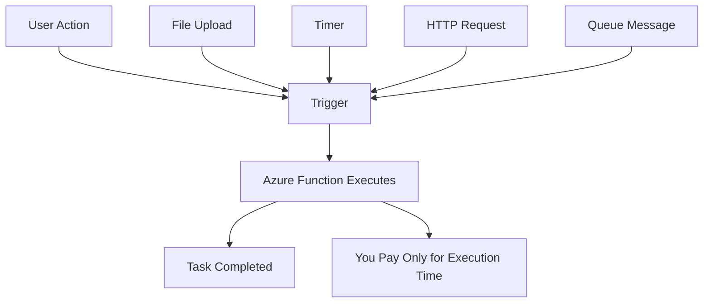

### 2. Storage Services 🗄️

**Analogy**: Azure Storage is like a **digital warehouse** with different areas for different types of items.

#### Storage Account Types

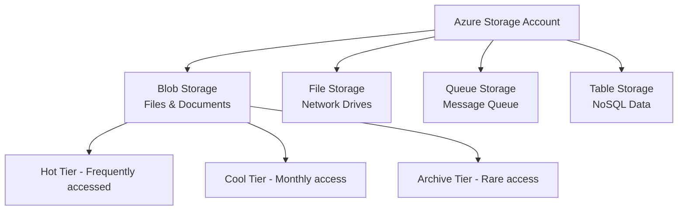

#### Blob Storage
**What**: Storage for any type of file (images, videos, documents, backups)
**Analogy**: Like a massive digital filing cabinet
**Access Tiers**:
- **Hot**: Like items on your desk - expensive to store, cheap to access
- **Cool**: Like items in desk drawer - moderate cost for both
- **Archive**: Like items in basement storage - cheap to store, expensive to retrieve

#### File Storage
**What**: Managed file shares accessible via SMB protocol
**Analogy**: Like a shared network drive at your office
**Use Cases**: Shared application data, content repositories, diagnostic data

#### Queue Storage
**What**: Messaging service for communication between applications
**Analogy**: Like a digital post office where applications leave messages for each other

### 3. Networking Services 🌐

**Analogy**: Azure Networking is like **city infrastructure** - roads (networks), traffic lights (firewalls), bridges (gateways), and street signs (DNS).

#### Virtual Network (VNet)
**What**: Private network in Azure for your resources
**Analogy**: Like a private neighborhood with controlled access
**Key Features**:
- Isolation and segmentation
- Communication with internet, on-premises, other VNets
- Traffic filtering and routing

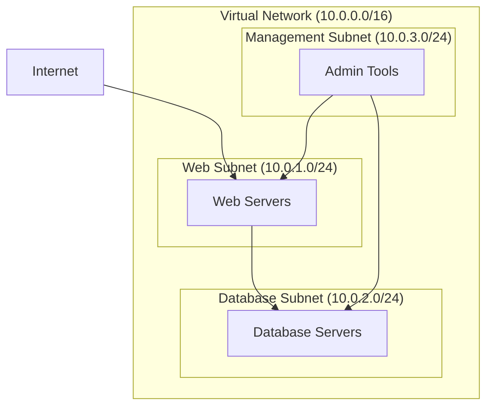

#### Load Balancer
**What**: Distributes incoming network traffic across multiple resources
**Analogy**: Like a traffic cop directing cars to different lanes to prevent congestion
**Types**:
- **Public Load Balancer**: Routes internet traffic to VMs
- **Internal Load Balancer**: Routes traffic within VNet

#### Application Gateway
**What**: Web traffic load balancer with additional features
**Analogy**: Like a smart receptionist who not only directs visitors but also checks credentials
**Features**:
- SSL termination
- Web Application Firewall
- URL-based routing

### 4. Database Services 🗃️

**Analogy**: Azure databases are like different types of **libraries** - some for books (relational), some for artifacts (NoSQL), some for newspapers (time-series).

#### Azure SQL Database
**What**: Fully managed SQL Server database in the cloud
**Analogy**: Like having a professional librarian manage your book collection
**Benefits**:
- No infrastructure management
- Automatic updates and patches
- Built-in high availability
- Advanced security features

#### Azure Cosmos DB
**What**: Globally distributed, multi-model NoSQL database
**Analogy**: Like a universal translator that can work with any language and is available worldwide
**Key Features**:
- Global distribution
- Multiple APIs (SQL, MongoDB, Gremlin, etc.)
- Guaranteed low latency
- Automatic scaling

### Service Interaction Example

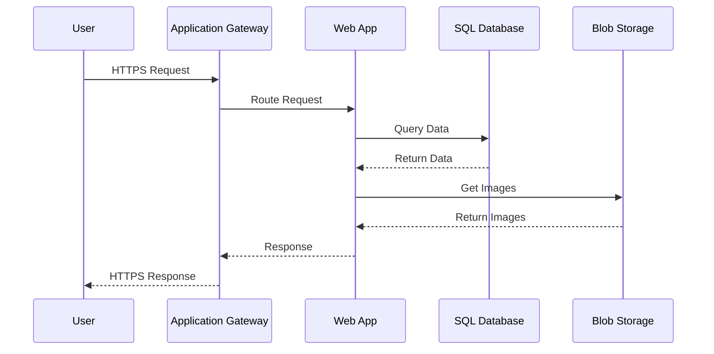

---

## 5. Azure Resource Management

### Understanding Azure Resource Hierarchy

**Analogy**: Think of Azure resource organization like a **corporate structure** - you have the company (Tenant), departments (Subscriptions), teams (Resource Groups), and employees (Resources).

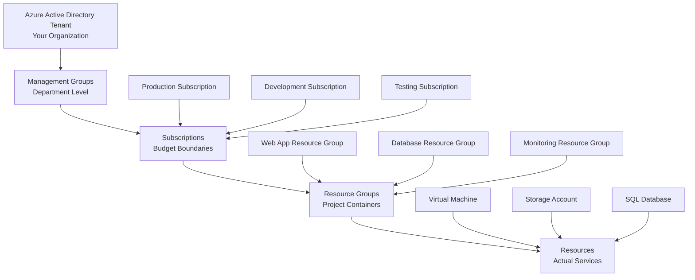

### Key Concepts

#### 1. Tenant
**What**: Represents your organization in Azure
**Analogy**: Like your company's main headquarters
**Key Points**:
- Usually associated with your domain name
- Can have multiple subscriptions
- Identity and access management boundary

#### 2. Subscription
**What**: Billing and administrative boundary
**Analogy**: Like different credit cards for different purposes (personal, business, travel)
**Common Patterns**:
- **By Environment**: Production, Development, Testing
- **By Department**: Marketing, Sales, IT
- **By Project**: Project A, Project B

#### 3. Resource Group
**What**: Logical container for related resources
**Analogy**: Like a project folder containing all related documents
**Best Practices**:
- Group resources with same lifecycle
- Apply common policies and permissions
- Usually tied to specific applications or environments

#### 4. Resources
**What**: Individual services (VM, Database, Storage)
**Analogy**: Like individual tools in your toolbox

### Resource Group Strategies

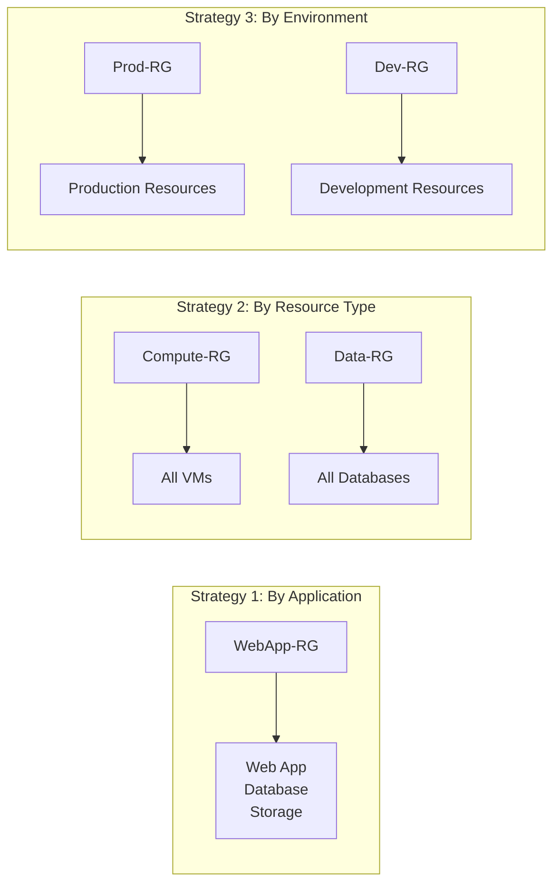

### Azure Resource Manager (ARM)

**What**: The deployment and management service for Azure
**Analogy**: Like a **smart construction foreman** who coordinates all workers and ensures everything is built according to blueprint

#### ARM Templates
**What**: JSON files that define infrastructure as code
**Analogy**: Like architectural blueprints for buildings

**Benefits**:
- **Consistency**: Same result every time
- **Version Control**: Track changes over time
- **Dependencies**: Ensures correct deployment order
- **Idempotent**: Safe to run multiple times

### Tagging Strategy

**What**: Metadata labels for organizing and tracking resources
**Analogy**: Like putting labels on boxes when moving - helps organize and find things

**Common Tag Examples**:
```json
{
    "Environment": "Production",
    "Project": "WebStore",
    "Owner": "john.doe@company.com",
    "CostCenter": "Marketing",
    "CreatedDate": "2025-01-15"
}
```

### Locks and Policies

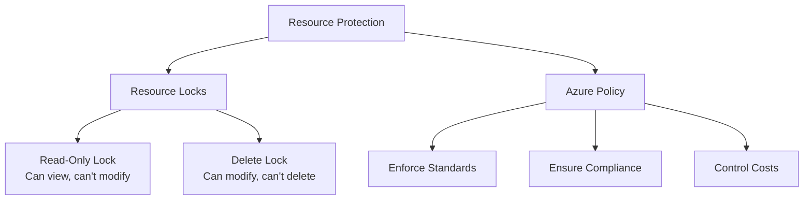

---

## 6. Azure Networking Fundamentals

### Networking Concepts Made Simple

**Analogy**: Think of Azure networking like **city planning** - you need roads (networks), traffic rules (security groups), bridges (gateways), and postal codes (IP addresses).

### Virtual Network (VNet) Deep Dive

#### VNet Components

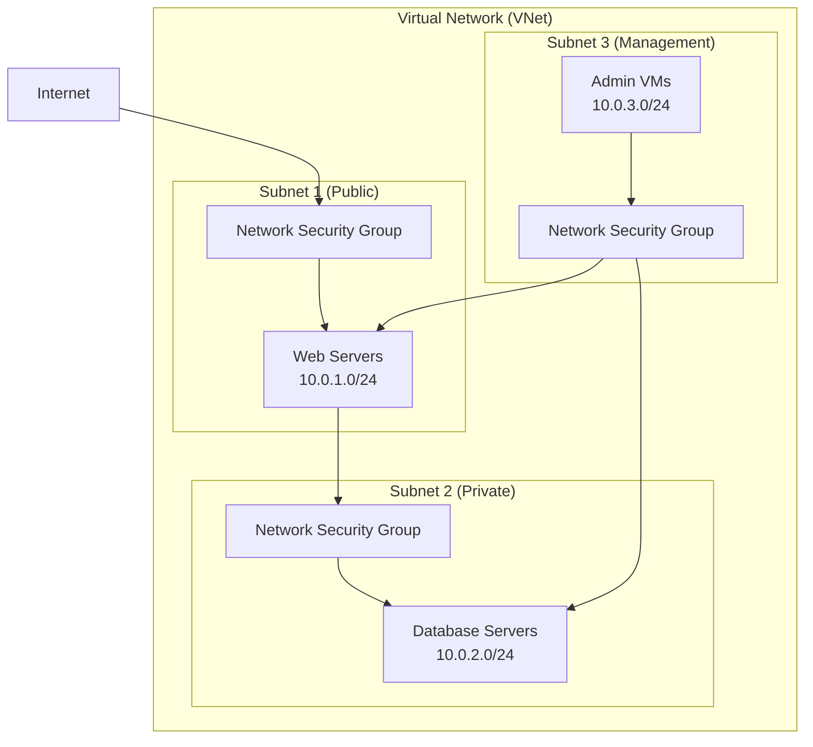

### IP Addressing in Azure

#### Understanding CIDR Notation
**Example**: `10.0.0.0/16` means:
- Network: 10.0.0.0
- Subnet Mask: 16 bits for network, 16 bits for hosts
- Available IPs: 65,536 addresses

#### Common Azure IP Ranges

| CIDR | Total IPs | Typical Use |
|------|-----------|-------------|
| /16 | 65,536 | Large enterprise VNet |
| /20 | 4,096 | Department VNet |
| /24 | 256 | Single subnet |
| /28 | 16 | Small subnet |

### Network Security Groups (NSGs)

**What**: Virtual firewalls for controlling network traffic
**Analogy**: Like security guards at building entrances checking IDs

#### NSG Rule Structure
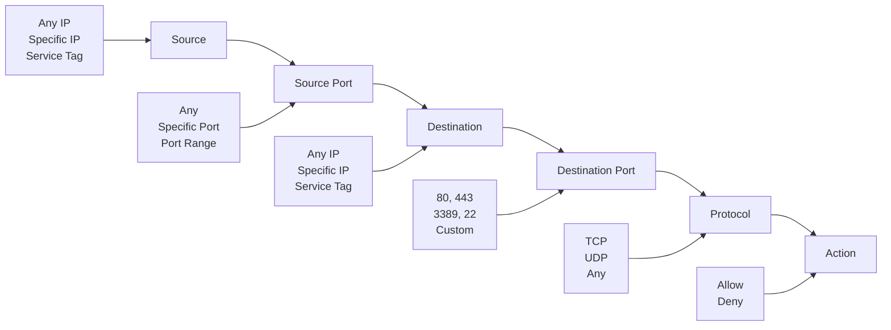

#### Common NSG Rules

| Rule | Source | Port | Destination | Purpose |
|------|--------|------|-------------|---------|
| Allow HTTP | Internet | 80 | Web Subnet | Web traffic |
| Allow HTTPS | Internet | 443 | Web Subnet | Secure web |
| Allow RDP | Admin IPs | 3389 | Management | Windows remote |
| Allow SSH | Admin IPs | 22 | Management | Linux remote |
| Deny All | Any | Any | Any | Default deny |

### Load Balancing Options

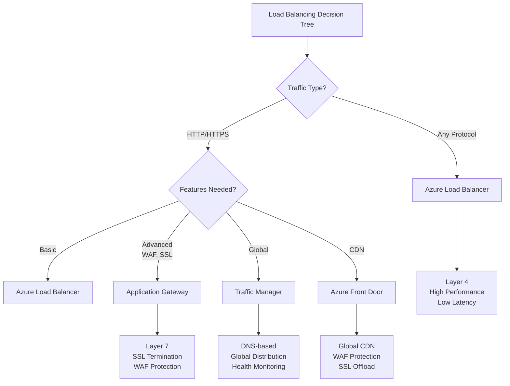

### Connectivity Options

#### Hybrid Connectivity

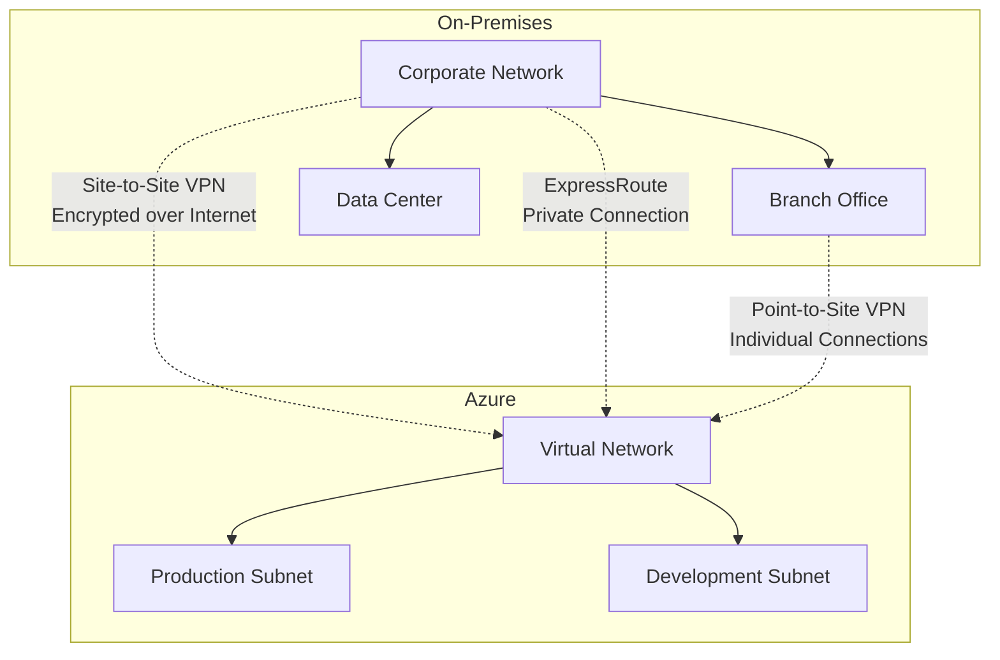

#### Connection Types Comparison

| Connection Type | Speed | Cost | Security | Use Case |
|----------------|-------|------|----------|----------|
| **Site-to-Site VPN** | Up to 10 Gbps | Low | High | Small to medium businesses |
| **ExpressRoute** | Up to 100 Gbps | High | Highest | Enterprise, mission-critical |
| **Point-to-Site VPN** | Up to 1 Gbps | Very Low | High | Remote workers |

### DNS in Azure

#### Azure DNS Zones

**What**: Hosting service for DNS domains
**Analogy**: Like a phone book that translates names to numbers

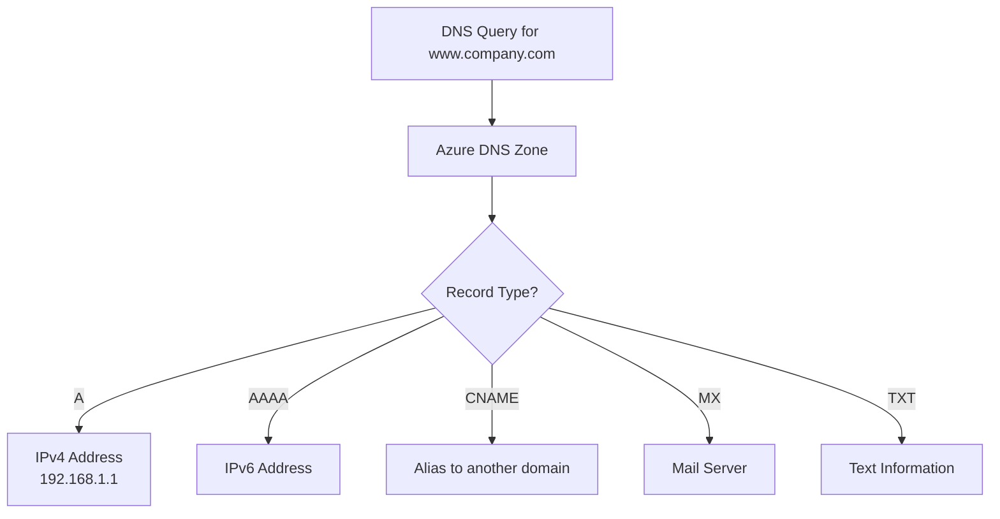

---

## 7. Azure Security & Identity

### Security: Your Digital Fortress 🏰

**Analogy**: Think of Azure security like protecting a medieval castle - you need multiple layers of defense: moat (network security), walls (firewalls), guards (identity management), and treasure room locks (data encryption).

### Azure Security Model: Defense in Depth

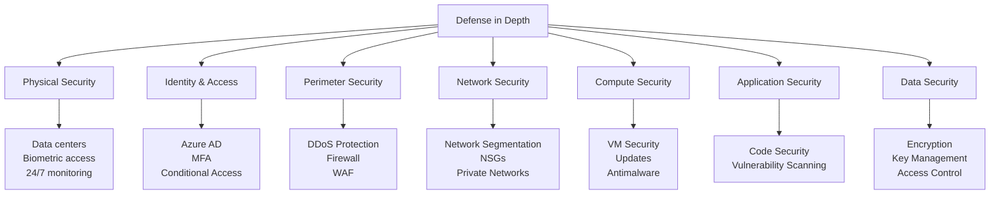

### Azure Active Directory (Azure AD / Entra ID)

**What**: Microsoft's cloud-based identity and access management service
**Analogy**: Like a **digital bouncer** at a club who checks IDs, remembers regular customers, and decides who gets VIP access

#### Key Features

1. **Single Sign-On (SSO)**
   - **What**: One login for multiple applications
   - **Analogy**: Like a master key that opens all doors in your building
   - **Benefit**: Users login once, access everything they're authorized for

2. **Multi-Factor Authentication (MFA)**
   - **What**: Requires multiple forms of verification
   - **Analogy**: Like ATM requiring both card AND PIN
   - **Methods**: Password + Phone call/Text/App notification

3. **Conditional Access**
   - **What**: Access policies based on conditions
   - **Analogy**: Like a smart door that checks who you are, where you are, and what you're trying to access
   - **Examples**: Require MFA when accessing from unknown location

#### Azure AD Structure

```mermaid
graph TD
    A[Azure AD Tenant<br/>company.onmicrosoft.com] --> B[Users]
    A --> C[Groups]
    A --> D[Applications]
    A --> E[Devices]
    
    B --> B1[Internal Users<br/>john@company.com]
    B --> B2[External Users<br/>partner@external.com]
    B --> B3[Service Principals<br/>Apps & Services]
    
    C --> C1[Security Groups<br/>For permissions]
    C --> C2[Distribution Groups<br/>For email]
    C --> C3[Microsoft 365 Groups<br/>For collaboration]
    
    D --> D1[Enterprise Apps<br/>Office 365, Salesforce]
    D --> D2[App Registrations<br/>Custom Apps]
    
    E --> E1[Azure AD Joined<br/>Cloud-only devices]
    E --> E2[Hybrid Joined<br/>Domain + Azure AD]
```

### Role-Based Access Control (RBAC)

**What**: System for managing access to Azure resources
**Analogy**: Like **job roles in a hospital** - doctors can access patient records, nurses can update charts, but janitors can only access supply closets

#### RBAC Components

```mermaid
graph LR
    A[Security Principal<br/>WHO] --> B[Role Assignment<br/>CONNECTS] 
    B --> C[Role Definition<br/>WHAT]
    B --> D[Scope<br/>WHERE]
    
    A1[User<br/>Group<br/>Service Principal] --> A
    C1[Owner<br/>Contributor<br/>Reader<br/>Custom] --> C
    D1[Management Group<br/>Subscription<br/>Resource Group<br/>Resource] --> D
```

#### Built-in Roles

| Role | Description | Can Do | Cannot Do |
|------|-------------|---------|-----------|
| **Owner** | Full access | Everything | Transfer billing ownership |
| **Contributor** | Create/manage resources | Create, modify, delete resources | Assign roles to others |
| **Reader** | View only | View resources and settings | Make any changes |
| **User Access Administrator** | Manage access | Assign roles | Create resources |

### Azure Key Vault

**What**: Secure storage for secrets, keys, and certificates
**Analogy**: Like a **bank safety deposit box** for your digital valuables

```mermaid
graph TD
    A[Azure Key Vault] --> B[Secrets]
    A --> C[Keys]  
    A --> D[Certificates]
    
    B --> B1[Passwords]
    B --> B2[Connection Strings]
    B --> B3[API Keys]
    
    C --> C1[Encryption Keys]
    C --> C2[Signing Keys]
    
    D --> D1[SSL/TLS Certificates]
    D --> D2[Code Signing Certificates]
    
    E[Applications] --> F[Request Secret]
    F --> G[Azure AD Authentication]
    G --> H[Key Vault Access Policy]
    H --> I[Return Secret]
```

#### Key Vault Benefits

1. **Centralized Secrets Management**: One secure place for all secrets
2. **Access Logging**: Know who accessed what and when
3. **Integration**: Works seamlessly with Azure services
4. **HSM-backed**: Hardware Security Module for maximum protection

### Network Security

#### Azure Firewall
**What**: Managed, cloud-based network security service
**Analogy**: Like a **security checkpoint** at an airport - inspects all traffic and blocks threats

**Features**:
- Application and network-level filtering
- Threat intelligence integration
- High availability and scalability
- SNAT and DNAT support

#### DDoS Protection
**What**: Protection against Distributed Denial of Service attacks
**Analogy**: Like **crowd control barriers** that prevent overwhelming your venue

**Tiers**:
- **Basic**: Automatic protection included with Azure
- **Standard**: Advanced monitoring and mitigation

### Data Security

#### Encryption Overview

```mermaid
graph TD
    A[Data Encryption in Azure] --> B[Data at Rest]
    A --> C[Data in Transit]
    A --> D[Data in Use]
    
    B --> B1[Storage Service Encryption]
    B --> B2[Database Transparent Data Encryption]
    B --> B3[Disk Encryption]
    
    C --> C1[HTTPS/TLS]
    C --> C2[VPN]
    C --> C3[ExpressRoute]
    
    D --> D1[Always Encrypted]
    D --> D2[Confidential Computing]
```

#### Encryption Types

| Type | When | Example | Key Management |
|------|------|---------|----------------|
| **At Rest** | Data stored | Files on disk | Microsoft or Customer managed |
| **In Transit** | Data moving | Web traffic | Automatic with HTTPS |
| **In Use** | Data processed | Database queries | Application level |

---

## 8. Azure Pricing & Cost Management

### Understanding Azure Pricing 💰

**Analogy**: Azure pricing is like **utility bills** - you pay for what you use, with different rates for peak/off-peak times, and bulk discounts for heavy usage.

### Pricing Models

#### 1. Pay-As-You-Go
**What**: Standard on-demand pricing
**Analogy**: Like a taxi meter - pay for exactly what you use
**Best For**: Development, testing, unpredictable workloads

#### 2. Reserved Instances
**What**: Commit to 1 or 3 years for significant discounts
**Analogy**: Like signing a gym membership - commit longer, pay less monthly
**Savings**: Up to 72% compared to pay-as-you-go
**Best For**: Predictable, steady-state workloads

#### 3. Spot Pricing
**What**: Unused capacity at reduced rates, can be interrupted
**Analogy**: Like airline standby tickets - cheap but might get bumped
**Savings**: Up to 90% discount
**Best For**: Fault-tolerant, flexible workloads

### Cost Factors Deep Dive

```mermaid
graph TD
    A[Azure Cost Factors] --> B[Compute]
    A --> C[Storage]
    A --> D[Networking]
    A --> E[Region]
    A --> F[Usage Time]
    
    B --> B1[VM Size<br/>CPU/Memory]
    B --> B2[Operating System<br/>Windows vs Linux]
    B --> B3[Reserved vs On-demand]
    
    C --> C1[Storage Type<br/>SSD vs HDD]
    C --> C2[Access Tier<br/>Hot/Cool/Archive]
    C --> C3[Redundancy<br/>Local/Zone/Geo]
    
    D --> D1[Data Transfer<br/>Ingress/Egress]
    D --> D2[Load Balancer<br/>Basic/Standard/Gateway]
    
    E --> E1[Region Selection<br/>US vs Europe vs Asia]
    
    F --> F1[Always On vs<br/>Start/Stop Schedule]
```

### Example: VM Pricing Breakdown

**Scenario**: D2s_v3 Virtual Machine (2 vCPUs, 8 GB RAM) in East US

| Component | Monthly Cost | Notes |
|-----------|--------------|-------|
| **Compute** | $70.08 | Linux VM, pay-as-you-go |
| **Storage** | $4.81 | 30 GB Premium SSD |
| **Network** | $5.00 | Outbound data transfer |
| **Total** | $79.89 | Per month |

**With Reserved Instance**: $25.26/month (3-year commitment) = 68% savings!

### Cost Management Tools

#### Azure Cost Management + Billing

```mermaid
graph LR
    A[Cost Management] --> B[Cost Analysis]
    A --> C[Budgets]
    A --> D[Cost Alerts]
    A --> E[Recommendations]
    
    B --> B1[View spending by<br/>Service, Resource Group, Tags]
    C --> C1[Set spending limits<br/>Monthly/Quarterly budgets]
    D --> D1[Email notifications<br/>When thresholds hit]
    E --> E1[Right-size VMs<br/>Unused resources<br/>Reserved instances]
```

#### Azure Advisor Cost Recommendations
**What**: AI-powered recommendations to optimize costs
**Common Suggestions**:
1. **Resize underutilized VMs**: VM using only 10% CPU
2. **Delete unused resources**: Storage accounts with no activity
3. **Buy reserved instances**: For consistent workloads
4. **Use lower-cost regions**: Move non-latency sensitive workloads

### Cost Optimization Strategies

#### 1. Right-Sizing Resources

**Analogy**: Like buying clothes that fit - don't buy XL when you need size M

```mermaid
graph LR
    A[Monitor Usage] --> B[Analyze Performance]
    B --> C[Identify Over-provisioned]
    C --> D[Resize Resources]
    D --> E[Monitor Again]
    E --> A
```

#### 2. Scheduling Resources

**What**: Start/stop resources based on usage patterns
**Example**: Development VMs only needed during business hours

**Savings Calculation**:
- VM running 24/7: $70/month
- VM running 8 hours/day, 5 days/week: $12/month
- **Savings**: 83%!

#### 3. Using Appropriate Storage Tiers

| Data Type | Recommended Tier | Cost Comparison |
|-----------|------------------|----------------|
| **Active website images** | Hot | Baseline cost |
| **Monthly reports** | Cool | 50% less storage cost |
| **Legal archives** | Archive | 80% less storage cost |

### Billing and Tagging Strategy

#### Effective Tagging for Cost Tracking

```json
{
    "Environment": "Production",
    "Project": "WebStore",
    "Owner": "john.doe@company.com", 
    "CostCenter": "Marketing",
    "BusinessUnit": "E-commerce",
    "Application": "CustomerPortal"
}
```

#### Cost Analysis by Tags

```mermaid
pie title Monthly Spending by Environment
    "Production" : 60
    "Development" : 25
    "Testing" : 10
    "Sandbox" : 5
```

### Free Tier and Credits

#### Azure Free Account Benefits
Enjoy 20+ popular services free for 12 months, more than 65+ services free always, and $200 credit to use in your first 30 days

**Always Free Services** (Popular ones):
- 750 hours of B1S Linux VMs
- 5 GB blob storage
- 250 GB SQL Database
- 1 million Azure Functions requests
- 15 GB bandwidth

#### Cost Monitoring Dashboard Example

```mermaid
graph TD
    A[Monthly Budget: $1000] --> B[Current Spend: $650]
    B --> C[Remaining: $350]
    
    D[Top Spending Services] --> D1[Virtual Machines: $300]
    D --> D2[SQL Database: $200] 
    D --> D3[Storage: $150]
    
    E[Cost Alerts] --> E1[80% Budget Alert: ON]
    E --> E2[Unusual Spending: ON]
    E --> E3[Department Overage: ON]
```

---

## 9. Getting Started - Hands-on

### Your First Steps in Azure 🚀

**Analogy**: Starting with Azure is like **learning to drive** - you start with basics in a safe environment before hitting the highway.

### Creating Your Azure Account

#### Step 1: Sign Up Process
1. **Visit**: [https://azure.microsoft.com/free/](https://azure.microsoft.com/free/)
2. **Choose Account Type**:
   - **Personal**: Microsoft account (@outlook.com, @hotmail.com)
   - **Work/School**: Organization account
3. **Verification**: Phone number and credit card (for identity, not charged)
4. **Welcome Credits**: $200 for first 30 days

#### Step 2: Understanding the Azure Portal

**Analogy**: The Azure Portal is like a **Swiss Army knife** - one tool with many functions, organized in a logical way.

```mermaid
graph TD
    A[Azure Portal Layout] --> B[Top Navigation Bar]
    A --> C[Left Menu Panel]
    A --> D[Main Content Area]
    A --> E[Right Information Panel]
    
    B --> B1[Search Box]
    B --> B2[Cloud Shell]
    B --> B3[Notifications]
    B --> B4[Account Settings]
    
    C --> C1[All Services]
    C --> C2[Resource Groups]
    C --> C3[Create Resource]
    C --> C4[Favorites]
    
    D --> D1[Dashboard]
    D --> D2[Resource Details]
    D --> D3[Configuration]
    
    E --> E1[Help & Support]
    E --> E2[Documentation]
    E --> E3[Feedback]
```

### Hands-On Lab 1: Create Your First VM

#### Prerequisites Checklist
- [ ] Azure account created
- [ ] Access to Azure Portal
- [ ] Understanding of basic concepts

#### Step-by-Step VM Creation

**Phase 1: Basic Configuration**

1. **Navigate to Virtual Machines**
   ```
   Azure Portal → Create a resource → Compute → Virtual Machine
   ```

2. **Basic Settings**
   ```
   Resource Group: Create new → "lab-rg"
   VM Name: "my-first-vm"
   Region: "East US" (choose closest to you)
   Image: "Ubuntu Server 20.04 LTS"
   Size: "Standard_B1s" (cheapest for learning)
   ```

3. **Authentication**
   ```
   Authentication type: SSH public key
   Username: azureuser
   SSH key: Generate new key pair
   ```

**Phase 2: Networking**

```mermaid
graph TD
    A[VM Networking Setup] --> B[Virtual Network]
    A --> C[Subnet]
    A --> D[Public IP]
    A --> E[Network Security Group]
    
    B --> B1[Create new: lab-vnet]
    C --> C1[default: 10.0.0.0/24]
    D --> D1[Create new: Standard]
    E --> E1[Allow SSH: Port 22]
```

**Phase 3: Management**
```
Monitoring: Enable basic monitoring
Auto-shutdown: Enable at 7 PM
Backup: Disable (for lab)
```

#### Connecting to Your VM

**For Windows users (using PuTTY or Windows Subsystem for Linux)**:
```bash
ssh azureuser@<your-vm-public-ip>
```

**For Mac/Linux users**:
```bash
ssh -i /path/to/private/key azureuser@<your-vm-public-ip>
```

### Hands-On Lab 2: Create a Simple Web App

#### Objective
Deploy a basic web application using Azure App Service

#### Step 1: Create App Service
```
Azure Portal → Create a resource → Web → Web App

App Name: "my-first-webapp-[unique-number]"
Resource Group: Use existing "lab-rg"
Runtime Stack: "Node.js 14 LTS"
Operating System: Linux
Region: East US
App Service Plan: Create new (Free F1)
```

#### Step 2: Deploy Sample Code
1. **Go to Deployment Center** in your Web App
2. **Choose Source**: GitHub (or Local Git)
3. **Sample Application**: Use Azure's sample Node.js app

#### Step 3: Access Your Application
- **URL**: `https://your-app-name.azurewebsites.net`
- **Expected Result**: "Hello World" or sample application page

### Hands-On Lab 3: Storage Account Basics

#### Create Storage Account
```
Azure Portal → Create a resource → Storage → Storage Account

Name: "mystorageacct[random-numbers]"
Resource Group: "lab-rg"  
Region: East US
Performance: Standard
Redundancy: LRS (Locally Redundant Storage)
```

#### Upload Your First File

1. **Navigate to Storage Account** → Data storage → Containers
2. **Create Container**: 
   - Name: "documents"
   - Public access: Private
3. **Upload File**: Click Upload, select any document
4. **Generate SAS URL**: For secure, temporary access

#### Access Patterns

```mermaid
graph LR
    A[File Upload] --> B[Blob Storage]
    B --> C[Access Methods]
    
    C --> C1[Azure Portal<br/>Manual Access]
    C --> C2[Storage Explorer<br/>Desktop App]
    C --> C3[PowerShell/CLI<br/>Command Line]
    C --> C4[REST API<br/>Programming]
```

### Monitoring Your Resources

#### Azure Monitor Basics

**What to Monitor**:
- VM CPU usage
- Web app response times  
- Storage account transactions
- Cost accumulation

#### Setting Up Basic Alerts

1. **Go to Monitor** → Alerts → New Alert Rule
2. **Target**: Select your VM
3. **Condition**: CPU percentage > 80%
4. **Action**: Email notification to you
5. **Alert Name**: "High CPU Usage"

### Clean-Up Checklist

**Important**: Always clean up lab resources to avoid charges!

```bash
# Using Azure CLI
az group delete --name lab-rg --yes --no-wait

# Or via Portal
Azure Portal → Resource Groups → lab-rg → Delete Resource Group
```

**Clean-up Verification**:
- [ ] All VMs stopped/deleted
- [ ] Storage accounts deleted
- [ ] App Services deleted  
- [ ] Resource group deleted
- [ ] Check billing for $0 daily charges

### Common Beginner Mistakes

| Mistake | Impact | Prevention |
|---------|---------|-----------|
| **Forgetting to stop VMs** | Continuous charges | Set auto-shutdown |
| **Wrong VM size** | High costs | Start with B-series |
| **Wrong region** | Higher latency/costs | Choose nearest region |
| **No resource cleanup** | Ongoing charges | Delete resource groups |
| **Premium storage by accident** | 10x cost increase | Choose Standard for learning |

---

## 10. DevOps with Azure

### Azure DevOps: Your Development Superhighway 🛣️

**Analogy**: Azure DevOps is like a **modern assembly line** for software - raw ideas enter one end, and polished, tested, deployed applications come out the other end.

### Azure DevOps Services Overview

```mermaid
graph LR
    A[Plan] --> B[Code]
    B --> C[Build] 
    C --> D[Test]
    D --> E[Deploy]
    E --> F[Monitor]
    F --> A
    
    A1[Azure Boards<br/>Work Items<br/>Sprints] --> A
    B1[Azure Repos<br/>Git Repositories<br/>Version Control] --> B
    C1[Azure Pipelines<br/>CI/CD<br/>Build Automation] --> C
    D1[Test Plans<br/>Manual Testing<br/>Load Testing] --> D
    E1[Release Management<br/>Deployment Groups<br/>Environments] --> E
    F1[Azure Monitor<br/>Application Insights<br/>Log Analytics] --> F
```

### Understanding CI/CD

#### Continuous Integration (CI)
**What**: Automatically building and testing code changes
**Analogy**: Like a **quality control inspector** on an assembly line - checking every piece before it moves forward

**Benefits**:
- Catch bugs early
- Reduce integration problems  
- Faster feedback to developers
- Automated testing

#### Continuous Deployment (CD)
**What**: Automatically deploying tested code to production
**Analogy**: Like a **fast food restaurant** - once an order is ready and quality-checked, it's immediately delivered to the customer

### Azure Pipelines Deep Dive

#### Pipeline Structure

```mermaid
graph TD
    A[Pipeline Trigger] --> B[Agent Pool]
    B --> C[Build Stage]
    C --> D[Test Stage] 
    D --> E[Deploy Stage]
    
    A1[Code Push<br/>Pull Request<br/>Schedule] --> A
    B1[Microsoft-hosted<br/>Self-hosted<br/>Container] --> B
    C1[Compile Code<br/>Package Apps<br/>Create Artifacts] --> C
    D1[Unit Tests<br/>Integration Tests<br/>Security Scans] --> D
    E1[Dev Environment<br/>Staging<br/>Production] --> E
```

#### Sample Pipeline (YAML)

```yaml
# Azure Pipeline for Node.js Web App
trigger:
- main

pool:
  vmImage: 'ubuntu-latest'

stages:
- stage: Build
  jobs:
  - job: BuildJob
    steps:
    - task: NodeTool@0
      inputs:
        versionSpec: '14.x'
    - script: npm install
      displayName: 'Install dependencies'
    - script: npm run build
      displayName: 'Build application'
    - script: npm test
      displayName: 'Run tests'
    - task: PublishBuildArtifacts@1
      inputs:
        PathtoPublish: '$(Build.ArtifactStagingDirectory)'

- stage: Deploy
  condition: succeeded()
  jobs:
  - deployment: DeployWeb
    environment: 'production'
    strategy:
      runOnce:
        deploy:
          steps:
          - task: AzureWebApp@1
            inputs:
              azureSubscription: 'MySubscription'
              appName: 'my-webapp'
              package: '$(Pipeline.Workspace)/**/*.zip'
```

### Infrastructure as Code (IaC)

#### ARM Templates vs Bicep vs Terraform

**Analogy**: These are like **different languages** for describing your infrastructure - all can build the same house, but with different syntax.

```mermaid
graph TD
    A[Infrastructure as Code] --> B[ARM Templates<br/>Native Azure JSON]
    A --> C[Bicep<br/>Azure-friendly DSL]  
    A --> D[Terraform<br/>Multi-cloud HCL]
    
    B --> B1[✅ Native integration<br/>❌ Complex syntax<br/>❌ Hard to read]
    C --> C1[✅ Simple syntax<br/>✅ Azure optimized<br/>❌ Azure only]
    D --> D1[✅ Multi-cloud<br/>✅ Large community<br/>❌ Extra complexity]
```

#### Sample Bicep Template

```bicep
// Bicep template for simple web app
param webAppName string = 'mywebapp${uniqueString(resourceGroup().id)}'
param sku string = 'F1'
param location string = resourceGroup().location

resource appServicePlan 'Microsoft.Web/serverfarms@2021-02-01' = {
  name: '${webAppName}-plan'
  location: location
  sku: {
    name: sku
    capacity: 1
  }
}

resource webApplication 'Microsoft.Web/sites@2021-02-01' = {
  name: webAppName
  location: location
  properties: {
    serverFarmId: appServicePlan.id
    httpsOnly: true
  }
}

output webAppUrl string = 'https://${webApplication.properties.defaultHostName}'
```

### Git Workflow with Azure Repos

#### Branching Strategy

```mermaid
graph TD
    A[main branch<br/>Production ready] --> B[develop branch<br/>Integration branch]
    B --> C[feature/login<br/>New login feature]
    B --> D[feature/payment<br/>Payment system] 
    B --> E[hotfix/security<br/>Critical bug fix]
    
    C --> F[Pull Request]
    D --> G[Pull Request]
    F --> B
    G --> B
    
    E --> A
```

#### Development Workflow

1. **Create Feature Branch**
   ```bash
   git checkout -b feature/user-authentication
   ```

2. **Make Changes & Commit**
   ```bash
   git add .
   git commit -m "Add user login functionality"
   git push origin feature/user-authentication
   ```

3. **Create Pull Request**
   - Review by team members
   - Automated tests run
   - Code quality checks

4. **Merge to Main**
   - Pipeline automatically deploys to staging
   - After validation, deploy to production

### Environments and Deployment Strategies

#### Deployment Environments

```mermaid
graph LR
    A[Development<br/>Individual dev work] --> B[Testing<br/>QA validation]
    B --> C[Staging<br/>Production-like testing]
    C --> D[Production<br/>Live users]
    
    A1[Frequent deployments<br/>Unstable<br/>Latest features] --> A
    B1[Automated testing<br/>Bug reproduction<br/>Integration tests] --> B  
    C1[Final validation<br/>Performance testing<br/>User acceptance] --> C
    D1[Stable releases<br/>Monitored<br/>High availability] --> D
```

#### Deployment Strategies

| Strategy | Description | Risk Level | Use Case |
|----------|-------------|------------|----------|
| **Blue-Green** | Two identical environments, switch traffic | Low | Critical applications |
| **Canary** | Gradual rollout to small user percentage | Medium | A/B testing |
| **Rolling** | Update instances one by one | Medium | Standard updates |
| **Recreate** | Stop old, start new | High | Simple applications |

### Monitoring and Application Insights

#### Application Performance Monitoring

```mermaid
graph TD
    A[Application Insights] --> B[Performance Metrics]
    A --> C[User Behavior]
    A --> D[Error Tracking]
    A --> E[Custom Events]
    
    B --> B1[Response Times<br/>Dependency Calls<br/>Server Metrics]
    C --> C1[Page Views<br/>User Sessions<br/>Geographic Data]
    D --> D1[Exceptions<br/>Failed Requests<br/>Trace Logs]
    E --> E1[Business Events<br/>Custom Metrics<br/>Feature Usage]
```

#### Key Metrics to Monitor

**Performance Metrics**:
- Response time < 2 seconds
- Availability > 99.9%
- Error rate < 1%

**Business Metrics**:
- User registrations
- Purchase completions
- Feature adoption rates

### DevOps Best Practices

#### 1. Security Integration (DevSecOps)

```mermaid
graph LR
    A[Plan] --> B[Code<br/>+Security Reviews]
    B --> C[Build<br/>+Security Scanning]
    C --> D[Test<br/>+Penetration Testing]
    D --> E[Deploy<br/>+Security Validation]
    E --> F[Monitor<br/>+Security Monitoring]
    F --> A
```

#### 2. Configuration Management

**Principles**:
- **Environment Parity**: All environments configured identically
- **Configuration as Code**: Store settings in version control
- **Secret Management**: Use Azure Key Vault for sensitive data
- **Feature Flags**: Toggle features without deployments

#### 3. Testing Strategy Pyramid

```mermaid
graph TD
    A[Testing Pyramid] --> B[Unit Tests<br/>70% of tests]
    A --> C[Integration Tests<br/>20% of tests]
    A --> D[UI/E2E Tests<br/>10% of tests]
    
    B --> B1[Fast execution<br/>High coverage<br/>Isolated components]
    C --> C1[API testing<br/>Database integration<br/>Service interactions]
    D --> D1[User workflows<br/>Browser testing<br/>Full system validation]
```

---

## 11. Best Practices

### Azure Well-Architected Framework 🏗️

**Analogy**: Building applications on Azure is like **constructing a skyscraper** - you need strong foundations, good design, proper safety measures, and efficient operations.

### The Five Pillars

```mermaid
mindmap
  root)Well-Architected Framework(
    Reliability
      High Availability
      Disaster Recovery
      Fault Tolerance
      Self-healing
    Security
      Identity Management
      Data Protection
      Network Security
      Monitoring
    Cost Optimization
      Resource Planning
      Cost Monitoring
      Right-sizing
      Reserved Capacity
    Operational Excellence
      Automation
      Monitoring
      DevOps Practices
      Documentation
    Performance Efficiency
      Scaling Strategy
      Resource Selection
      Monitoring
      Optimization
```

### 1. Reliability Pillar

#### Design for Failure
**Philosophy**: Assume everything will fail, design for resilience
**Analogy**: Like a **ship with multiple watertight compartments** - if one floods, others keep it afloat

#### Availability Zones Strategy

```mermaid
graph TB
    subgraph "Multi-Zone Deployment"
        subgraph "Zone 1"
            A1[Web App Instance 1]
            B1[Database Replica 1]
        end
        subgraph "Zone 2" 
            A2[Web App Instance 2]
            B2[Database Replica 2]
        end
        subgraph "Zone 3"
            A3[Web App Instance 3] 
            B3[Database Replica 3]
        end
    end
    
    C[Load Balancer] --> A1
    C --> A2  
    C --> A3
    
    B1 -.->|Sync| B2
    B2 -.->|Sync| B3
```

#### Backup and Recovery Strategy

| Recovery Type | RTO* | RPO* | Implementation |
|---------------|------|------|----------------|
| **High Availability** | < 1 minute | < 1 minute | Multi-zone deployment |
| **Disaster Recovery** | < 1 hour | < 15 minutes | Cross-region replication |
| **Backup Restore** | < 4 hours | < 24 hours | Regular backups |

*RTO = Recovery Time Objective, RPO = Recovery Point Objective

### 2. Security Pillar

#### Zero Trust Model
**Principle**: "Never trust, always verify"
**Analogy**: Like a **high-security building** where every door requires credentials, even if you're already inside

```mermaid
graph TD
    A[Zero Trust Security] --> B[Verify Identity]
    A --> C[Validate Device]
    A --> D[Check Location]
    A --> E[Assess Risk]
    A --> F[Least Privilege]
    
    B --> B1[Multi-factor Authentication<br/>Strong passwords<br/>Conditional access]
    C --> C1[Device compliance<br/>Managed devices<br/>Health attestation]
    D --> D1[Known locations<br/>VPN requirements<br/>Geo-blocking]
    E --> E1[Behavioral analysis<br/>Threat intelligence<br/>Risk scoring]
    F --> F1[Just-in-time access<br/>Role-based permissions<br/>Regular reviews]
```

#### Security Layers Implementation

**Network Security**:
- Network Security Groups (NSGs)
- Azure Firewall
- Private endpoints
- DDoS protection

**Data Protection**:
- Encryption at rest and in transit
- Key management with Key Vault
- Data classification and labeling
- Regular access reviews

**Identity Security**:
- Azure AD with MFA
- Conditional access policies
- Privileged Identity Management
- Regular access certifications

### 3. Cost Optimization Pillar

#### Resource Lifecycle Management

```mermaid
graph LR
    A[Provision] --> B[Monitor]
    B --> C[Optimize]
    C --> D[Review]
    D --> E[Decommission]
    E --> A
    
    A1[Right-size from start<br/>Choose appropriate tiers] --> A
    B1[Track usage patterns<br/>Monitor costs daily] --> B
    C1[Resize resources<br/>Change tiers<br/>Use automation] --> C
    D1[Monthly cost review<br/>Usage analysis<br/>Budget variance] --> D
    E1[Clean unused resources<br/>Archive old data<br/>Remove test environments] --> E
```

#### Cost Optimization Checklist

**Compute Optimization**:
- [ ] Use appropriate VM sizes
- [ ] Implement auto-shutdown for dev/test
- [ ] Consider Azure Reserved VMs for production
- [ ] Use Azure Hybrid Benefit for Windows/SQL

**Storage Optimization**:
- [ ] Use appropriate storage tiers
- [ ] Implement lifecycle management
- [ ] Clean up old snapshots and backups
- [ ] Use compression where possible

**Network Optimization**:
- [ ] Minimize cross-region traffic
- [ ] Use CDN for static content
- [ ] Optimize ExpressRoute usage
- [ ] Review bandwidth requirements

### 4. Operational Excellence Pillar

#### DevOps Maturity Model

```mermaid
graph TD
    A[Level 1: Manual] --> B[Level 2: Scripted]
    B --> C[Level 3: Automated]
    C --> D[Level 4: Self-Service]
    D --> E[Level 5: AI-Driven]
    
    A --> A1[Manual deployments<br/>Manual testing<br/>Manual monitoring]
    B --> B1[Scripted deployments<br/>Automated builds<br/>Basic monitoring]
    C --> C1[CI/CD pipelines<br/>Automated testing<br/>Infrastructure as Code]
    D --> D1[Self-service portals<br/>Auto-scaling<br/>Self-healing systems]
    E --> E1[Predictive scaling<br/>AI-driven insights<br/>Autonomous operations]
```

#### Monitoring and Alerting Strategy

**Monitoring Levels**:
1. **Infrastructure**: CPU, memory, disk, network
2. **Platform**: Application performance, errors, latency  
3. **Business**: User behavior, conversions, revenue

**Alert Categories**:
```mermaid
graph TD
    A[Alerts] --> B[Critical<br/>Immediate Action]
    A --> C[Warning<br/>Plan Action]
    A --> D[Informational<br/>Track Trends]
    
    B --> B1[System down<br/>Security breach<br/>Data corruption]
    C --> C1[High CPU usage<br/>Error rate increase<br/>Capacity threshold]
    D --> D1[Usage patterns<br/>Performance trends<br/>Cost changes]
```

### 5. Performance Efficiency Pillar

#### Scaling Strategies

```mermaid
graph TD
    A[Scaling Strategies] --> B[Vertical Scaling<br/>Scale Up/Down]
    A --> C[Horizontal Scaling<br/>Scale Out/In]
    
    B --> B1[Increase VM size<br/>Add CPU/Memory<br/>Limited by hardware]
    C --> C1[Add more instances<br/>Load balancer distribution<br/>Better fault tolerance]
    
    D[Auto-scaling Rules] --> D1[CPU > 70%: Scale out]
    D --> D2[Queue length > 100: Scale out]
    D --> D3[CPU < 30%: Scale in]
```

#### Performance Optimization Techniques

**Database Performance**:
- Use proper indexing
- Implement connection pooling
- Consider read replicas
- Optimize queries

**Application Performance**:
- Implement caching strategies
- Use CDN for static content
- Optimize images and assets
- Minimize external dependencies

**Network Performance**:
- Use proximity placement groups
- Implement connection multiplexing
- Optimize payload sizes
- Use compression

### Naming Conventions and Tagging

#### Resource Naming Standards

**Format**: `{resourcetype}-{application}-{environment}-{location}-{instance}`

**Examples**:
```
vm-webstore-prod-eastus-001
sql-webstore-dev-westus-001
st-webstore-stage-northeu-001  (storage accounts need to be unique)
```

#### Comprehensive Tagging Strategy

```json
{
    "Environment": "Production",
    "Application": "WebStore", 
    "Owner": "john.doe@company.com",
    "CostCenter": "IT-001",
    "BusinessUnit": "E-commerce",
    "Project": "Q1-Modernization",
    "CreatedDate": "2025-01-15",
    "Criticality": "High",
    "DataClassification": "Internal",
    "BackupSchedule": "Daily"
}
```

### Security Best Practices Summary

#### Security Checklist

**Identity and Access**:
- [ ] Enable MFA for all admin accounts
- [ ] Use Azure AD Conditional Access
- [ ] Implement just-in-time VM access
- [ ] Regular access reviews and cleanup

**Network Security**:
- [ ] Use Network Security Groups appropriately
- [ ] Implement Azure Firewall for advanced filtering
- [ ] Enable DDoS protection for public resources
- [ ] Use private endpoints where possible

**Data Protection**:
- [ ] Enable encryption at rest for all data stores
- [ ] Use HTTPS/TLS for all communications
- [ ] Store secrets in Azure Key Vault
- [ ] Implement data backup and retention policies

**Monitoring and Compliance**:
- [ ] Enable Azure Security Center
- [ ] Configure security alerts and notifications
- [ ] Regular security assessments
- [ ] Document security procedures

---

## 12. Certification Path

### Azure Certification Journey 🎓

**Analogy**: Azure certifications are like **academic degrees** - you start with fundamentals (high school), move to specialized areas (bachelor's degree), and advance to expert level (master's/PhD).

### Certification Levels Overview

```mermaid
graph TD
    A[Azure Certifications] --> B[Fundamentals<br/>Beginner Level]
    A --> C[Associate<br/>Intermediate Level] 
    A --> D[Expert<br/>Advanced Level]
    A --> E[Specialty<br/>Specialized Skills]
    
    B --> B1[AZ-900<br/>Azure Fundamentals]
    B --> B2[AI-900<br/>AI Fundamentals]
    B --> B3[DP-900<br/>Data Fundamentals]
    
    C --> C1[AZ-104<br/>Azure Administrator]
    C --> C2[AZ-204<br/>Azure Developer]
    C --> C3[AZ-400<br/>DevOps Engineer]
    
    D --> D1[AZ-305<br/>Azure Solutions Architect]
    D --> D2[AZ-500<br/>Azure Security Engineer]
    
    E --> E1[Azure IoT<br/>Internet of Things]
    E --> E2[Azure AI<br/>Artificial Intelligence]
```

### Fundamentals Level (Perfect Starting Point)

#### AZ-900: Azure Fundamentals
In 2025, the AZ-900: Microsoft Azure Fundamentals certification is still useful, especially for people who are unfamiliar with cloud computing or Microsoft Azure. For novices or professionals in non-technical professions like sales or marketing who need to grasp the fundamentals of cloud computing, it offers a strong foundation

**What You'll Learn**:
- Cloud concepts and Azure services
- Azure pricing and support
- Security, privacy, compliance, and trust

**Study Path**:
```mermaid
graph LR
    A[Study Plan: 4-6 weeks] --> B[Week 1-2<br/>Cloud Concepts]
    B --> C[Week 3-4<br/>Core Azure Services]
    C --> D[Week 5<br/>Security & Compliance]
    D --> E[Week 6<br/>Pricing & Support]
    E --> F[Practice Tests]
    F --> G[Schedule Exam]
```

**Exam Details**:
- **Duration**: 85 minutes
- **Questions**: 40-60 questions
- **Pass Score**: 700/1000
- **Cost**: $99 USD
- **Question Types**: Multiple choice, drag and drop, case studies

### Associate Level Certifications

#### AZ-104: Azure Administrator Associate
IT professionals that oversee and manage Azure resources, such as storage, virtual networks, and monitoring, are the target audience for the AZ-104 certification

**Prerequisites**: AZ-900 (recommended but not required)

**Skills Measured**:
- Manage Azure identities and governance (20-25%)
- Implement and manage storage (15-20%)  
- Deploy and manage Azure compute resources (20-25%)
- Configure and manage virtual networking (25-30%)
- Monitor and maintain Azure resources (10-15%)

#### AZ-204: Azure Developer Associate
**Target Audience**: Developers who build cloud solutions

**Skills Measured**:
- Develop Azure compute solutions (25-30%)
- Develop for Azure storage (15-20%)
- Implement Azure security (20-25%)
- Monitor, troubleshoot, and optimize Azure solutions (15-20%)
- Connect to and consume Azure services (15-20%)

#### AZ-400: Azure DevOps Engineer Expert
**Prerequisites**: AZ-104 OR AZ-204

**Skills Measured**:
- Configure processes and communications (10-15%)
- Design and implement source control (15-20%)
- Design and implement build and release pipelines (40-45%)
- Develop a security and compliance plan (10-15%)
- Implement an instrumentation strategy (10-15%)

### Expert Level Certifications

#### AZ-305: Azure Solutions Architect Expert
**Prerequisites**: AZ-104 (Administrator) recommended

**What You'll Design**:
- Identity and security solutions
- Data storage and integration solutions  
- Business continuity solutions
- Infrastructure solutions

#### Study Timeline for Different Backgrounds

```mermaid
gantt
    title Certification Study Timeline
    dateFormat  X
    axisFormat %s
    
    section No Experience
    AZ-900 Fundamentals    :a1, 0, 6w
    AZ-104 Administrator   :a2, after a1, 10w
    AZ-305 Architect      :a3, after a2, 12w
    
    section IT Background
    AZ-900 Fundamentals   :b1, 0, 3w
    AZ-104 Administrator  :b2, after b1, 6w
    AZ-305 Architect     :b3, after b2, 8w
    
    section Cloud Experience
    AZ-104 Administrator  :c1, 0, 4w
    AZ-305 Architect     :c2, after c1, 6w
```

### Learning Resources

#### Microsoft Official Resources
1. **Microsoft Learn**: Free, interactive learning paths
2. **Microsoft Documentation**: Comprehensive technical docs
3. **Azure Architecture Center**: Real-world patterns and practices

#### Study Materials by Type

| Learning Style | Recommended Resources | Cost |
|----------------|----------------------|------|
| **Visual Learner** | Microsoft Learn modules, YouTube videos | Free |
| **Hands-on Learner** | Azure free account, labs | $0-200 |
| **Structured Learner** | Official courseware, instructor-led training | $1000-3000 |
| **Practice-focused** | Practice tests, exam dumps | $50-200 |

#### Hands-on Learning Approach

```mermaid
graph TD
    A[Learning Method] --> B[Read Documentation<br/>20%]
    A --> C[Watch Videos<br/>20%] 
    A --> D[Hands-on Practice<br/>60%]
    
    B --> B1[Microsoft Docs<br/>Azure Architecture Center<br/>Best practices guides]
    C --> C1[Microsoft Learn videos<br/>YouTube tutorials<br/>Webinars]
    D --> D1[Azure free account<br/>Personal projects<br/>Practice labs]
```

### Exam Preparation Strategy

#### Phase 1: Foundation Building (40% of study time)
- Understand core concepts
- Learn Azure terminology
- Practice with Azure portal
- Complete Microsoft Learn paths

#### Phase 2: Deep Dive (40% of study time)  
- Hands-on labs and exercises
- Build real projects
- Practice troubleshooting
- Study exam-specific topics

#### Phase 3: Test Preparation (20% of study time)
- Take practice exams
- Identify weak areas
- Review and reinforce
- Schedule and take exam

### Career Benefits and Salary Impact

#### Certification ROI

The Average salary of Microsoft Azure Certified is based on the experience level the person has, but the average salary is increased than a non-certified professional. Moreover, the opportunity to get selected for any role also gets increased

**Average Salary Increases**:
- **AZ-900**: 5-10% salary increase
- **AZ-104**: 15-25% salary increase  
- **AZ-305**: 25-40% salary increase

#### Career Paths

```mermaid
graph TD
    A[Azure Fundamentals<br/>AZ-900] --> B{Choose Path}
    
    B --> C[Administrator Path<br/>AZ-104]
    B --> D[Developer Path<br/>AZ-204]
    B --> E[Data Path<br/>DP-203]
    
    C --> F[DevOps Engineer<br/>AZ-400]
    C --> G[Security Engineer<br/>AZ-500]
    D --> F
    
    F --> H[Solutions Architect<br/>AZ-305]
    G --> H
```

### Maintaining Certifications

#### Renewal Requirements
- **Associate and Expert**: Annual renewal required
- **Fundamentals**: No renewal needed (valid for life)
- **Method**: Complete free renewal assessment on Microsoft Learn

#### Staying Current
- Follow Azure updates and new services
- Participate in Azure community
- Continue hands-on practice
- Attend Azure conferences and webinars

---

## Conclusion

### Your Azure Journey Continues 🚀

Congratulations! You've completed this comprehensive introduction to Microsoft Azure. This guide has taken you from absolute beginner to someone with a solid foundation in cloud computing and Azure services.

### Key Takeaways

1. **Cloud Computing is the Future**: According to a report by Indeed, the demand for Azure skills is growing by 200% year-over-year

2. **Start Small, Think Big**: Begin with the free tier and fundamental services, then expand as you gain confidence

3. **Hands-on Practice is Essential**: Reading about Azure is helpful, but actually using it is how you truly learn

4. **Security First**: Always implement proper security measures from the beginning

5. **Cost Management Matters**: Monitor your spending and optimize regularly

### Next Steps

1. **Create Your Free Azure Account**: If you haven't already, start with the $200 credit
2. **Complete Hands-on Labs**: Practice the examples in this guide
3. **Join the Community**: Participate in Azure forums and user groups
4. **Pursue Certification**: Start with AZ-900 Azure Fundamentals
5. **Build Real Projects**: Apply your knowledge to solve real problems

### Additional Resources

- **Official Azure Documentation**: [https://docs.microsoft.com/azure](https://docs.microsoft.com/azure)
- **Microsoft Learn**: [https://docs.microsoft.com/learn](https://docs.microsoft.com/learn)
- **Azure Blog**: [https://azure.microsoft.com/blog](https://azure.microsoft.com/blog)
- **Azure Updates**: [https://azure.microsoft.com/updates](https://azure.microsoft.com/updates)

### Remember

Azure is a vast platform with hundreds of services. Don't try to learn everything at once. Focus on understanding the core concepts and services first, then gradually expand your knowledge as your needs evolve.

**Good luck on your cloud journey!** ☁️

---

*This guide was created to help beginners understand Azure concepts through analogies and progressive learning. Keep this as a reference and update it as you learn new things about Azure.*

---