# AWS Cloud Deep Dive: Complete Learning Guide
## IAM | S3 | CloudFront | Frontend Hosting

---

## 🎯 Learning Objectives
By the end of this guide, you will understand:
- What AWS cloud computing is and why it matters
- How to secure and control access to AWS resources with IAM
- How to store and serve files with Amazon S3
- How to deliver content globally with CloudFront
- How to host a complete frontend application using S3 and CloudFront

---

## 📚 Table of Contents
1. [Introduction to AWS Cloud](#introduction-to-aws-cloud)
2. [AWS IAM (Identity and Access Management)](#aws-iam-identity-and-access-management)
3. [Amazon S3 (Simple Storage Service)](#amazon-s3-simple-storage-service)
4. [Amazon CloudFront](#amazon-cloudfront)
5. [Frontend Hosting with S3 and CloudFront](#frontend-hosting-with-s3-and-cloudfront)
6. [Hands-on Project](#hands-on-project)
7. [Best Practices](#best-practices)
8. [Common Issues and Solutions](#common-issues-and-solutions)

---

## 1. Introduction to AWS Cloud

### What is AWS?
**Amazon Web Services (AWS)** is like a massive digital toolbox that provides computing services over the internet. Instead of buying and maintaining your own servers, databases, and networking equipment, you can rent these resources from AWS on-demand.

#### 🏢 Real-World Analogy
Think of AWS like a **huge apartment complex**:
- Instead of building your own house (buying servers), you rent an apartment (use AWS services)
- You only pay for what you use (electricity, water, space)
- The complex handles maintenance, security, and utilities
- You can easily upgrade to a bigger apartment or downgrade as needed

### Why Use Cloud Services?

| Traditional IT | Cloud (AWS) |
|---|---|
| ❌ High upfront costs | ✅ Pay-as-you-go |
| ❌ Long setup time | ✅ Instant provisioning |
| ❌ Limited scalability | ✅ Scale up/down instantly |
| ❌ Maintenance overhead | ✅ AWS handles maintenance |
| ❌ Geographic limitations | ✅ Global presence |

### Core AWS Services Overview


---

## 2. AWS IAM (Identity and Access Management)

### What is IAM?

**AWS Identity and Access Management (IAM)** is like the security system for your AWS account. It controls **who** can access **what** resources and **how** they can use them.

#### 🏢 Real-World Analogy
Think of IAM like a **corporate office building security system**:
- **Users** = Employees with ID badges
- **Groups** = Departments (HR, Engineering, Marketing)
- **Roles** = Job positions (Manager, Developer, Intern)
- **Policies** = Permission rules (what floors you can access, what rooms you can enter)
- **MFA** = Security guard checking additional ID

### IAM Core Components

#### 2.1 IAM Users
**Users** represent individual people or services that need access to AWS resources.


**Best Practices for Users:**
- Create individual users for each person (never share accounts)
- Use strong passwords and enable MFA
- Rotate access keys regularly
- Follow the principle of least privilege

#### 2.2 IAM Groups
**Groups** are collections of users with similar job functions.

| Group Name | Typical Members | Permissions |
|---|---|---|
| Developers | Software engineers | Read/write to development resources |
| DevOps | Operations team | Full access to deployment tools |
| Managers | Team leads | Read-only access to billing and reports |
| Interns | New team members | Limited sandbox access |

**Example Group Structure:**


#### 2.3 IAM Roles
**Roles** are like temporary job assignments that can be assumed by users, applications, or AWS services.

#### 🏢 Real-World Analogy
Think of roles like **substitute teaching**:
- A regular teacher (user) might temporarily take on the role of "Principal" (role)
- While acting as principal, they get principal permissions
- When done, they go back to being a regular teacher
- Different people can assume the same role at different times

**Common Role Types:**

1. **Service Roles**: For AWS services to access other services
   ```
   Example: EC2 instance needs to read from S3 bucket
   → Create EC2-S3-Access role
   → Attach to EC2 instance
   ```

2. **Cross-Account Roles**: For accessing resources in different AWS accounts
   ```
   Example: Development account needs to deploy to Production account
   → Create deployment role in Production
   → Developers assume role when deploying
   ```

3. **Federated Roles**: For users from external identity providers
   ```
   Example: Company uses Google Workspace
   → Employees login with Google credentials
   → Automatically assume AWS role based on Google group
   ```

#### 2.4 IAM Policies
**Policies** define what actions are allowed or denied on which resources.

**Policy Structure:**
```json
{
  "Version": "2012-10-17",
  "Statement": [
    {
      "Effect": "Allow",
      "Action": "s3:GetObject",
      "Resource": "arn:aws:s3:::my-bucket/*",
      "Condition": {
        "IpAddress": {
          "aws:SourceIp": "203.0.113.0/24"
        }
      }
    }
  ]
}
```

**Policy Components Explained:**

| Component | Description | Example |
|---|---|---|
| **Effect** | Allow or Deny | "Allow", "Deny" |
| **Action** | What can be done | "s3:GetObject", "ec2:DescribeInstances" |
| **Resource** | What it applies to | "arn:aws:s3:::my-bucket/*" |
| **Condition** | When it applies | IP address, time of day, MFA status |

**Policy Types:**

1. **AWS Managed Policies**: Pre-built by AWS
   - `PowerUserAccess`: Full access except IAM
   - `ReadOnlyAccess`: Read-only access to all services
   - `AmazonS3FullAccess`: Full access to S3

2. **Customer Managed Policies**: Custom policies you create
   - Tailored to your specific needs
   - Can be attached to multiple users/groups/roles

3. **Inline Policies**: Directly embedded in a single user/group/role
   - 1:1 relationship
   - Deleted when the entity is deleted

### IAM Security Best Practices

#### 🔒 The Principle of Least Privilege
Give users only the minimum permissions needed to do their job.


#### 🛡️ Multi-Factor Authentication (MFA)

**What is MFA?**
MFA requires two or more verification factors:
1. **Something you know** (password)
2. **Something you have** (phone, token)
3. **Something you are** (fingerprint, face)

**MFA Options in AWS:**
- Virtual MFA devices (Google Authenticator, Authy)
- Hardware MFA devices (YubiKey)
- SMS text messages (less secure)

#### 🔄 Regular Access Reviews

| Review Frequency | What to Check | Action |
|---|---|---|
| Weekly | Active sessions, unusual login locations | Investigate anomalies |
| Monthly | User permissions vs. job requirements | Remove excessive permissions |
| Quarterly | Unused users and roles | Disable or delete |
| Yearly | Overall security posture | Update policies and procedures |

### IAM Hands-on Example

Let's create a simple IAM setup for a web development team:

**Step 1: Create Groups**
```bash
# Create groups
aws iam create-group --group-name WebDevelopers
aws iam create-group --group-name WebAdmins
```

**Step 2: Attach Policies to Groups**
```bash
# Developers get S3 and CloudFront read access
aws iam attach-group-policy --group-name WebDevelopers --policy-arn arn:aws:iam::aws:policy/AmazonS3ReadOnlyAccess

# Admins get full S3 and CloudFront access
aws iam attach-group-policy --group-name WebAdmins --policy-arn arn:aws:iam::aws:policy/AmazonS3FullAccess
```

**Step 3: Create Users and Add to Groups**
```bash
# Create user
aws iam create-user --user-name john-developer

# Add user to group
aws iam add-user-to-group --user-name john-developer --group-name WebDevelopers
```

---

## 3. Amazon S3 (Simple Storage Service)

### What is Amazon S3?

**Amazon Simple Storage Service (S3)** is like a massive digital warehouse where you can store any type of file and access it from anywhere in the world.

#### 🏢 Real-World Analogy
Think of S3 like a **giant self-storage facility**:
- **Buckets** = Storage units of different sizes
- **Objects** = Items you store in the units
- **Keys** = Addresses/labels on each item
- **Regions** = Different storage facility locations
- **Durability** = Fire-proof, flood-proof, theft-proof storage

### S3 Core Concepts

#### 3.1 Buckets
**Buckets** are containers for objects stored in S3. Each bucket has a globally unique name.


**Bucket Naming Rules:**
- Must be globally unique across ALL AWS accounts
- 3-63 characters long
- Only lowercase letters, numbers, hyphens, and periods
- Must start and end with a letter or number
- Cannot look like an IP address

**Good Examples:**
- `my-company-website-prod`
- `user-uploads-2024`
- `static-assets.example.com`

**Bad Examples:**
- `MyCompanyWebsite` (uppercase letters)
- `my_company_website` (underscores)
- `192.168.1.1` (looks like IP address)

#### 3.2 Objects
**Objects** are the files you store in S3. Each object consists of:

| Component | Description | Example |
|---|---|---|
| **Key** | Unique identifier (filename + path) | `images/products/laptop-1.jpg` |
| **Data** | The actual file content | Binary data of the image |
| **Metadata** | Information about the object | Content-type, upload date, custom tags |
| **Version ID** | Version identifier (if versioning enabled) | `VfE8rjJ3v1b9Kk5j2K8r` |

**Object Size Limits:**
- Minimum: 0 bytes
- Maximum: 5 TB (5,000 GB)
- For files > 100MB, use multipart upload

#### 3.3 S3 Storage Classes

S3 offers different storage classes optimized for different use cases:


**Choosing the Right Storage Class:**

| Use Case | Recommended Class | Why |
|---|---|---|
| Website files (HTML, CSS, JS) | Standard | Frequent access, need fast retrieval |
| User profile images | Standard or Intelligent-Tiering | Moderate access, varies by user |
| Log files for analysis | Standard-IA | Accessed occasionally for debugging |
| Legal documents | Glacier Flexible | Long-term retention, rare access |
| Compliance backups | Glacier Deep Archive | Very long-term, minimal access |

### S3 Security and Access Control

#### 3.4 Bucket Policies vs. ACLs

**Access Control Lists (ACLs)**: Simple, legacy method
```xml
<!-- Grant read access to everyone -->
<Grant>
    <Grantee xsi:type="Group">
        <URI>http://acs.amazonaws.com/groups/global/AllUsers</URI>
    </Grantee>
    <Permission>READ</Permission>
</Grant>
```

**Bucket Policies**: More powerful, JSON-based
```json
{
  "Version": "2012-10-17",
  "Statement": [
    {
      "Sid": "PublicReadGetObject",
      "Effect": "Allow",
      "Principal": "*",
      "Action": "s3:GetObject",
      "Resource": "arn:aws:s3:::my-website-bucket/*"
    }
  ]
}
```

#### 3.5 S3 Security Best Practices

1. **Block Public Access**: Enable by default, only disable when necessary
2. **Use IAM Policies**: Control access through IAM rather than bucket policies when possible
3. **Enable Versioning**: Protect against accidental deletion/modification
4. **Enable MFA Delete**: Require MFA to delete object versions
5. **Use Signed URLs**: For temporary access to private objects

**Public vs. Private Buckets:**

```mermaid
graph TD
    A[S3 Bucket Access] --> B[Public Bucket]
    A --> C[Private Bucket]
    
    B --> B1[Website hosting]
    B --> B2[Public downloads]
    B --> B3[CDN origin]
    B --> B4[⚠️ Security Risk]
    
    C --> C1[User uploads]
    C --> C2[Backups]
    C --> C3[Application data]
    C --> C4[✅ Secure by default]
```



### S3 Features Deep Dive

#### 3.6 Versioning
**Versioning** keeps multiple variants of an object in the same bucket.


**Benefits:**
- Protect against accidental deletion
- Track changes over time
- Easy rollback to previous versions

**Considerations:**
- Storage costs increase (each version is billed)
- Need lifecycle policies to manage old versions

#### 3.7 Lifecycle Management
**Lifecycle policies** automatically transition objects between storage classes or delete them.

**Example Lifecycle Rule:**
```json
{
  "Rules": [
    {
      "Id": "WebsiteContentLifecycle",
      "Status": "Enabled",
      "Filter": {"Prefix": "logs/"},
      "Transitions": [
        {
          "Days": 30,
          "StorageClass": "STANDARD_IA"
        },
        {
          "Days": 90,
          "StorageClass": "GLACIER"
        }
      ],
      "Expiration": {
        "Days": 365
      }
    }
  ]
}
```

This rule:
1. Moves log files to Standard-IA after 30 days
2. Moves to Glacier after 90 days
3. Deletes after 365 days

#### 3.8 S3 Website Hosting
S3 can host static websites directly.

**Requirements:**
1. Enable static website hosting on bucket
2. Make bucket and objects publicly readable
3. Specify index and error documents

**Example Website Structure:**
```
my-website-bucket/
├── index.html          # Homepage
├── error.html          # 404 page
├── css/
│   └── style.css      # Stylesheets
├── js/
│   └── script.js      # JavaScript
└── images/
    ├── logo.png       # Images
    └── hero.jpg
```

**Website Endpoint URL Format:**
- US East (N. Virginia): `http://bucket-name.s3-website-us-east-1.amazonaws.com`
- Other regions: `http://bucket-name.s3-website.region.amazonaws.com`

---

## 4. Amazon CloudFront

### What is Amazon CloudFront?

**Amazon CloudFront** is a Content Delivery Network (CDN) that delivers your content to users from locations closest to them, making your website faster and more reliable.

#### 🏢 Real-World Analogy
Think of CloudFront like a **pizza delivery chain**:
- **Origin Server** = Main pizza kitchen (your S3 bucket or web server)
- **Edge Locations** = Local pizza shops worldwide (CloudFront servers)
- **Caching** = Keeping popular pizzas ready at local shops
- **Cache Invalidation** = Updating the recipe at all shops when you change it

### How CloudFront Works


### CloudFront Core Concepts

#### 4.1 Distributions
A **distribution** is CloudFront's configuration that tells it how to handle requests for your content.

**Distribution Types:**
1. **Web Distribution**: For websites, APIs, and general content
2. **RTMP Distribution**: For streaming media (being phased out)

#### 4.2 Origins
An **origin** is the source of your original, definitive version of content.

**Origin Types:**

| Origin Type | Use Case | Example |
|---|---|---|
| **S3 Bucket** | Static websites, file downloads | `my-website-bucket.s3.amazonaws.com` |
| **Custom Origin** | Dynamic websites, APIs | `api.mycompany.com` |
| **Load Balancer** | High availability applications | `my-app-lb-123456789.us-east-1.elb.amazonaws.com` |

#### 4.3 Edge Locations and Regional Edge Caches


**Edge Locations**: Small caches close to users (~400 locations)
**Regional Edge Caches**: Larger caches between edge locations and origin (~13 locations)

Benefits:
- First user in a region: Slower (cache miss)
- Subsequent users: Much faster (cache hit)
- Popular content stays cached longer

#### 4.4 Behaviors and Cache Settings

**Behaviors** define how CloudFront handles different types of requests.

**Example Behavior Configuration:**

| Path Pattern | Origin | TTL | Headers Forwarded | Query Strings |
|---|---|---|---|---|
| `/api/*` | API Server | 0 seconds (no cache) | All | All |
| `/images/*` | S3 Bucket | 24 hours | None | None |
| `*.css` | S3 Bucket | 7 days | None | None |
| `*` (default) | S3 Bucket | 1 hour | None | None |

#### 4.5 SSL/TLS and Security

**CloudFront SSL Options:**

1. **CloudFront Default Certificate**: `*.cloudfront.net`
   - Free
   - Only works with CloudFront domain
   - Good for testing

2. **Custom SSL Certificate**: Your domain (e.g., `www.example.com`)
   - From AWS Certificate Manager (ACM) - Free
   - From third-party - Paid
   - Required for custom domains

**Security Features:**
- **Origin Access Control (OAC)**: Restricts direct access to S3
- **AWS WAF Integration**: Web application firewall
- **Field-Level Encryption**: Encrypt sensitive form fields
- **Geographic Restrictions**: Block/allow specific countries

### CloudFront Performance Optimization

#### 4.6 Caching Strategies

**Cache Headers:**

| Header | Purpose | Example |
|---|---|---|
| `Cache-Control` | How long to cache | `Cache-Control: max-age=86400` (24 hours) |
| `Expires` | Absolute expiration time | `Expires: Wed, 21 Oct 2024 07:28:00 GMT` |
| `ETag` | Version identifier | `ETag: "33a64df551"` |
| `Last-Modified` | When content was last changed | `Last-Modified: Wed, 21 Oct 2024 07:28:00 GMT` |

**Caching Best Practices:**


#### 4.7 Compression and File Optimization

**CloudFront Compression:**
- Automatically compresses files using gzip
- Reduces file sizes by 60-80%
- Supported formats: text, CSS, JavaScript, JSON, XML

**Before Compression:**
```
style.css: 100 KB
script.js: 250 KB
index.html: 50 KB
Total: 400 KB
```

**After Compression:**
```
style.css: 25 KB (-75%)
script.js: 60 KB (-76%)
index.html: 15 KB (-70%)
Total: 100 KB (75% reduction!)
```

### CloudFront Pricing

CloudFront pricing is based on:

1. **Data Transfer Out**: Cost per GB delivered
2. **HTTP/HTTPS Requests**: Cost per 10,000 requests
3. **Invalidation Requests**: First 1,000/month free
4. **Field Level Encryption**: Additional cost

**Pricing Tiers by Geography:**

| Region | Price per GB | Requests per 10K |
|---|---|---|
| US, Europe | $0.085 | $0.0075 |
| Asia Pacific | $0.140 | $0.0075 |
| South America | $0.250 | $0.0150 |

**Cost Optimization Tips:**
- Use appropriate cache TTLs to reduce origin requests
- Compress files before uploading to origin
- Use CloudFront's compression feature
- Consider Regional Edge Caches for large files

---

## 5. Frontend Hosting with S3 and CloudFront

### Why Use S3 + CloudFront for Frontend Hosting?

**Traditional Web Hosting vs. S3 + CloudFront:**

| Aspect | Traditional Hosting | S3 + CloudFront |
|---|---|---|
| **Cost** | Fixed monthly fee regardless of traffic | Pay only for what you use |
| **Scalability** | Limited by server capacity | Unlimited, auto-scaling |
| **Performance** | Single server location | Global CDN with edge locations |
| **Reliability** | Single point of failure | 99.999999999% (11 9's) durability |
| **Maintenance** | Server updates, security patches | Fully managed by AWS |
| **HTTPS** | Need to manage SSL certificates | Free SSL with AWS Certificate Manager |

### Architecture Overview


### Step-by-Step Implementation

#### Step 1: Prepare Your Frontend Application

**Typical Frontend Structure:**
```
my-react-app/
├── build/                 # Production build folder
│   ├── index.html        # Entry point
│   ├── static/
│   │   ├── css/
│   │   │   └── main.css  # Compiled CSS
│   │   ├── js/
│   │   │   └── main.js   # Compiled JavaScript
│   │   └── media/
│   │       └── logo.png  # Images, fonts, etc.
│   ├── manifest.json     # PWA manifest
│   └── robots.txt        # SEO directives
├── src/                  # Source code (not uploaded)
└── package.json          # Dependencies (not uploaded)
```

**Build Commands for Popular Frameworks:**

| Framework | Build Command | Output Directory |
|---|---|---|
| React (Create React App) | `npm run build` | `build/` |
| Vue.js | `npm run build` | `dist/` |
| Angular | `ng build --prod` | `dist/` |
| Next.js | `npm run build && npm run export` | `out/` |
| Gatsby | `gatsby build` | `public/` |

#### Step 2: Create and Configure S3 Bucket

**2.1 Create Bucket**
```bash
# Create bucket (replace with your unique name)
aws s3 mb s3://my-awesome-website-2024
```

**2.2 Enable Static Website Hosting**
```bash
# Configure website hosting
aws s3 website s3://my-awesome-website-2024 \
  --index-document index.html \
  --error-document error.html
```

**2.3 Set Bucket Policy for Public Read Access**
```json
{
  "Version": "2012-10-17",
  "Statement": [
    {
      "Sid": "PublicReadGetObject",
      "Effect": "Allow",
      "Principal": "*",
      "Action": "s3:GetObject",
      "Resource": "arn:aws:s3:::my-awesome-website-2024/*"
    }
  ]
}
```

**2.4 Upload Website Files**
```bash
# Upload all files from build directory
aws s3 sync ./build s3://my-awesome-website-2024 \
  --delete \
  --cache-control max-age=31536000
```

**Advanced Upload with Different Cache Settings:**
```bash
# HTML files: short cache (1 hour)
aws s3 sync ./build s3://my-awesome-website-2024 \
  --exclude "*" --include "*.html" \
  --cache-control max-age=3600

# CSS/JS files: long cache (1 year)
aws s3 sync ./build s3://my-awesome-website-2024 \
  --exclude "*" --include "*.css" --include "*.js" \
  --cache-control max-age=31536000

# Images: medium cache (1 month)
aws s3 sync ./build s3://my-awesome-website-2024 \
  --exclude "*" --include "*.png" --include "*.jpg" --include "*.gif" \
  --cache-control max-age=2592000
```

#### Step 3: Create CloudF