# CI/CD Fundamentals: GitHub Actions & GitLab CI Complete Guide

## Table of Contents

1. [Introduction to CI-CD](#1-introduction-to-ci-cd)
2. [Understanding CI vs CD](#2-understanding-ci-vs-cd)
3. [Automation in DevOps](#3-automation-in-devops)
4. [GitHub Actions Deep Dive](#4-github-actions-deep-dive)
5. [GitLab CI/CD Deep Dive](#5-gitlab-cicd-deep-dive)
6. [Comparison: GitHub Actions vs GitLab CI](#6-comparison-github-actions-vs-gitlab-ci)
7. [Infrastructure as Code (IaC)](#7-infrastructure-as-code-iac)
8. [Reusable Pipelines & Central Pipeline Methods](#8-reusable-pipelines--central-pipeline-methods)
9. [Best Practices & Implementation](#9-best-practices--implementation)
10. [Hands-On Examples](#10-hands-on-examples)
11. [Future Trends & Conclusion](#11-future-trends--conclusion)

---

## 1. Introduction to CI-CD

### What is CI/CD?

**CI/CD** stands for **Continuous Integration** and **Continuous Delivery/Deployment**. It's a methodology that aims to streamline and accelerate the software development lifecycle through automation, enabling teams to deliver code changes more frequently and reliably.

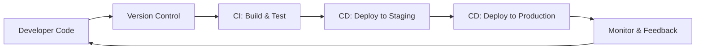

### The Evolution of Software Delivery

| Era | Approach | Release Cycle | Key Characteristics |
|-----|----------|---------------|-------------------|
| **Traditional** | Manual deployments | Months/Years | High risk, slow feedback |
| **Agile** | Sprint-based releases | Weeks | Improved collaboration |
| **DevOps** | Automated pipelines | Days/Hours | Fast feedback, reliable |
| **Modern CI/CD** | Continuous deployment | Minutes | Automated everything |

### Core Benefits of CI/CD

1. **🚀 Faster Time to Market**: Automated pipelines reduce deployment time from days to minutes
2. **🐛 Early Bug Detection**: Issues are caught within hours, not weeks
3. **💰 Cost Reduction**: Fixing bugs early is 100x cheaper than in production
4. **👥 Improved Collaboration**: Breaks down silos between Dev and Ops teams
5. **📊 Better Quality**: Automated testing ensures consistent quality standards
6. **🔄 Rapid Feedback**: Get user feedback quickly and iterate faster

---

## 2. Understanding CI vs CD

### Continuous Integration (CI)

**Continuous Integration** is the practice of frequently merging code changes into a shared repository, followed by automated builds and tests.

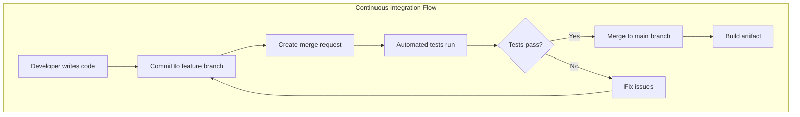

#### Key CI Principles

- **Frequent commits**: Developers integrate code at least daily
- **Automated testing**: Every commit triggers automated tests
- **Fast feedback**: Issues are identified within minutes
- **Shared repository**: Single source of truth for all code

### Continuous Delivery vs Continuous Deployment

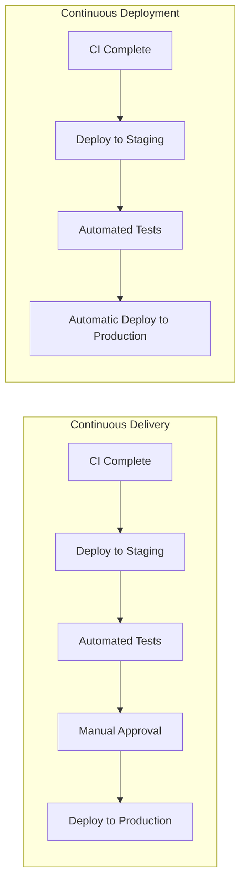

| Aspect | Continuous Delivery | Continuous Deployment |
|--------|-------------------|---------------------|
| **Automation Level** | Automated until production | Fully automated |
| **Human Intervention** | Required for production release | No manual gates |
| **Risk Level** | Lower (human verification) | Higher (requires robust testing) |
| **Release Frequency** | On-demand | Every successful build |
| **Best For** | Most organizations | Mature DevOps teams |

### The CI/CD Pipeline Stages

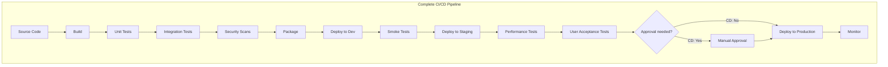

---

## 3. Automation in DevOps

### The DevOps Automation Landscape

DevOps automation encompasses various practices and tools that eliminate manual, repetitive tasks throughout the software development lifecycle.

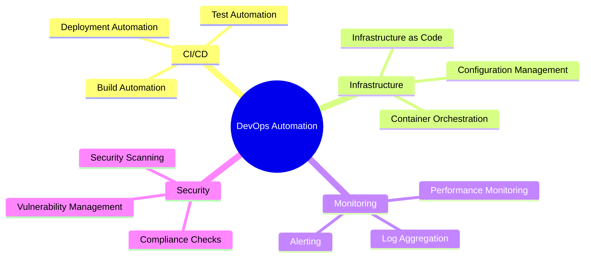

### Key Automation Areas

#### 1. **Build Automation**

- Compiles source code into executable artifacts
- Manages dependencies
- Creates container images
- Generates documentation

#### 2. **Test Automation**

- **Unit Tests**: Test individual components
- **Integration Tests**: Test component interactions
- **End-to-End Tests**: Test complete user workflows
- **Performance Tests**: Ensure scalability
- **Security Tests**: Identify vulnerabilities

#### 3. **Deployment Automation**

- **Blue-Green Deployments**: Switch between two identical environments
- **Canary Releases**: Gradual rollout to subset of users
- **Rolling Updates**: Update instances one at a time
- **Feature Flags**: Toggle features without deployment

### Infrastructure as Code (IaC)

IaC treats infrastructure configuration as software code, enabling version control, testing, and automation.

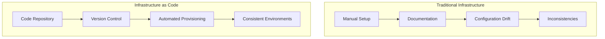

**Popular IaC Tools:**

- **Terraform**: Multi-cloud provisioning
- **AWS CloudFormation**: AWS-specific
- **Ansible**: Configuration management
- **Pulumi**: Programming language approach

---

## 4. GitHub Actions Deep Dive

### What is GitHub Actions?

GitHub Actions is GitHub's native CI/CD platform that enables automation directly within GitHub repositories. Launched in 2018, it has become one of the most popular CI/CD solutions due to its tight integration with GitHub's ecosystem.

### Philosophy and Architecture

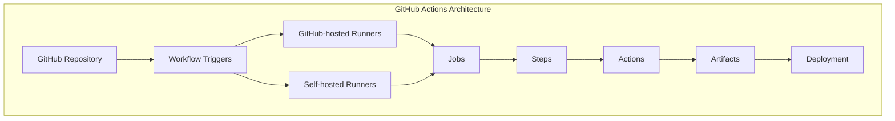

### Core Concepts

#### 1. **Workflows**

- YAML files in `.github/workflows/` directory
- Define automated processes
- Triggered by events

#### 2. **Events**

- Push, Pull Request, Schedule
- Issue creation, Release
- Manual dispatch
- Webhook events

#### 3. **Jobs**

- Units of work that run on runners
- Can run in parallel or sequentially
- Share data through artifacts

#### 4. **Steps**

- Individual tasks within a job
- Run commands or actions
- Execute in order

#### 5. **Actions**

- Reusable units of code
- Community marketplace
- Custom actions possible

### GitHub Actions Workflow Structure

```yaml
name: CI/CD Pipeline
on:
  push:
    branches: [ main, develop ]
  pull_request:
    branches: [ main ]

jobs:
  build:
    runs-on: ubuntu-latest
    steps:
      - uses: actions/checkout@v4
      - name: Setup Node.js
        uses: actions/setup-node@v4
        with:
          node-version: '18'
      - name: Install dependencies
        run: npm ci
      - name: Run tests
        run: npm test
      - name: Build application
        run: npm run build
      
  deploy:
    needs: build
    runs-on: ubuntu-latest
    if: github.ref == 'refs/heads/main'
    steps:
      - name: Deploy to production
        run: echo "Deploying to production"
```

### Key Features of GitHub Actions

| Feature | Description | Benefits |
|---------|-------------|----------|
| **Marketplace** | 20,000+ pre-built actions | Rapid development |
| **Matrix Builds** | Test across multiple versions | Comprehensive testing |
| **Secrets Management** | Encrypted storage | Secure credentials |
| **Artifacts** | Share data between jobs | Flexible workflows |
| **Caching** | Speed up workflows | Faster builds |
| **Environments** | Control deployments | Better security |
| **Reusable Workflows** | Share across repos | DRY principle |

### Advanced GitHub Actions Features

#### Matrix Strategy

```yaml
strategy:
  matrix:
    os: [ubuntu-latest, windows-latest, macos-latest]
    node: [14, 16, 18]
```

#### Conditional Execution

```yaml
steps:
  - name: Deploy
    if: github.event_name == 'push' && github.ref == 'refs/heads/main'
    run: ./deploy.sh
```

#### Workflow Dispatch

```yaml
on:
  workflow_dispatch:
    inputs:
      environment:
        description: 'Deployment environment'
        required: true
        default: 'staging'
```

---

## 5. GitLab CI/CD Deep Dive

### What is GitLab CI/CD?

GitLab CI/CD is an integrated continuous integration and delivery platform that's been part of GitLab since its early versions. It provides a complete DevOps solution within a single application.

### Philosophy and Architecture

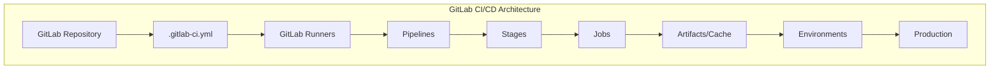

### Core Concepts

#### 1. **Pipelines**

- Top-level component
- Contains multiple stages
- Defined in `.gitlab-ci.yml`

#### 2. **Stages**

- Logical divisions of pipeline
- Run sequentially
- Common: build, test, deploy

#### 3. **Jobs**

- Atomic units of work
- Run in parallel within stages
- Define what to execute

#### 4. **Runners**

- Agents that execute jobs
- Shared or specific
- Support various executors

### GitLab CI/CD Configuration

```yaml
stages:
  - build
  - test
  - deploy

variables:
  NODE_VERSION: "18"

before_script:
  - apt-get update -qq
  - apt-get install -y nodejs npm

build:
  stage: build
  script:
    - npm install
    - npm run build
  artifacts:
    paths:
      - dist/
    expire_in: 1 week

test:
  stage: test
  script:
    - npm test
  coverage: '/Coverage: \d+\.\d+%/'

deploy_staging:
  stage: deploy
  script:
    - echo "Deploying to staging"
  environment:
    name: staging
    url: https://staging.example.com
  only:
    - develop

deploy_production:
  stage: deploy
  script:
    - echo "Deploying to production"
  environment:
    name: production
    url: https://example.com
  only:
    - main
  when: manual
```

### Key Features of GitLab CI/CD

| Feature | Description | Benefits |
|---------|-------------|----------|
| **All-in-One Platform** | Complete DevOps lifecycle | Unified experience |
| **Auto DevOps** | Automatic CI/CD setup | Quick start |
| **Security Scanning** | Built-in SAST/DAST | Shift-left security |
| **Review Apps** | Dynamic environments | Better testing |
| **Multi-project Pipelines** | Cross-project dependencies | Complex workflows |
| **Compliance Management** | Audit and controls | Enterprise ready |
| **Container Registry** | Built-in Docker registry | Seamless integration |

### Advanced GitLab CI/CD Features

#### Parent-Child Pipelines

```yaml
trigger_child:
  trigger:
    include: child-pipeline.yml
    strategy: depend
```

#### Dynamic Environments

```yaml
deploy_review:
  script: deploy_review_app
  environment:
    name: review/$CI_COMMIT_REF_NAME
    url: https://$CI_COMMIT_REF_SLUG.example.com
    on_stop: stop_review
```

#### Merge Trains

```yaml
# Ensures main branch stability
# by testing merge results in sequence
```

---

## 6. Comparison: GitHub Actions vs GitLab CI

### Feature Comparison Matrix

| Feature | GitHub Actions | GitLab CI/CD |
|---------|---------------|--------------|
| **Configuration** | Multiple YAML files | Single `.gitlab-ci.yml` |
| **Marketplace** | 20,000+ actions | CI/CD Catalog (growing) |
| **Runners** | GitHub-hosted + self-hosted | GitLab-hosted + self-hosted |
| **Platform Support** | Linux, Windows, macOS | Linux, Windows (beta), macOS (beta) |
| **Integration** | GitHub ecosystem | All-in-one DevOps |
| **Security Features** | Via marketplace | Built-in SAST/DAST |
| **Pricing** | Usage-based | Tier-based |
| **Learning Curve** | Easier for beginners | Steeper but more powerful |

### Architecture Comparison

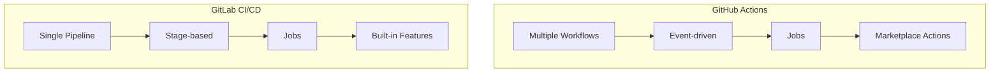

### When to Choose Which?

#### Choose GitHub Actions if

- ✅ Already using GitHub for repositories
- ✅ Need extensive third-party integrations
- ✅ Want quick setup with marketplace actions
- ✅ Prefer event-driven workflows
- ✅ Working on open-source projects

#### Choose GitLab CI/CD if

- ✅ Need all-in-one DevOps platform
- ✅ Require built-in security scanning
- ✅ Want advanced deployment strategies
- ✅ Need compliance and audit features
- ✅ Prefer self-hosted solution

### Philosophy Differences

| Aspect | GitHub Actions | GitLab CI/CD |
|--------|---------------|--------------|
| **Approach** | Repository-centric | Platform-centric |
| **Design** | Modular, composable | Integrated, comprehensive |
| **Flexibility** | High (marketplace) | High (built-in features) |
| **Complexity** | Lower entry barrier | Higher but more control |

---

## 7. Infrastructure as Code (IaC)

### Understanding IaC

Infrastructure as Code is the practice of managing and provisioning infrastructure through machine-readable definition files rather than manual hardware configuration.

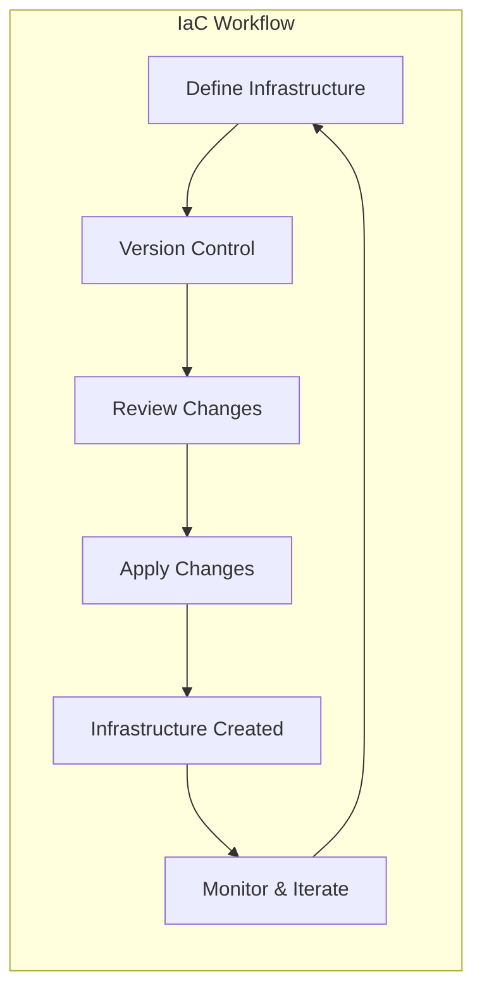

### IaC Principles

1. **Declarative vs Imperative**
   - **Declarative**: Describe desired state
   - **Imperative**: Describe steps to achieve state

2. **Idempotency**
   - Same result regardless of how many times applied
   - Prevents configuration drift

3. **Version Control**
   - Track all infrastructure changes
   - Enable rollbacks and auditing

### IaC in CI/CD Pipelines

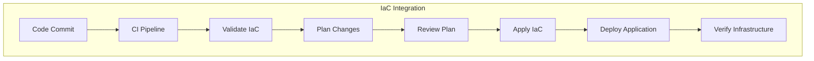

### Example: Terraform in CI/CD

```yaml
# GitHub Actions with Terraform
terraform:
  runs-on: ubuntu-latest
  steps:
    - uses: actions/checkout@v4
    - uses: hashicorp/setup-terraform@v2
    
    - name: Terraform Init
      run: terraform init
      
    - name: Terraform Plan
      run: terraform plan -out=tfplan
      
    - name: Terraform Apply
      if: github.ref == 'refs/heads/main'
      run: terraform apply -auto-approve tfplan
```

### IaC Best Practices

| Practice | Description | Benefit |
|----------|-------------|---------|
| **Modular Design** | Break infrastructure into reusable modules | Maintainability |
| **State Management** | Centralize state files | Collaboration |
| **Policy as Code** | Enforce compliance rules | Security |
| **Testing** | Test infrastructure code | Reliability |
| **Documentation** | Document infrastructure decisions | Knowledge sharing |

---

## 8. Reusable Pipelines & Central Pipeline Methods

### The Challenge of Pipeline Sprawl

As organizations grow, they often face "pipeline sprawl" - hundreds of repositories with similar but slightly different CI/CD configurations. This leads to:

- **Duplicated code** across pipelines
- **Inconsistent practices** between teams
- **Maintenance nightmares** when updating common patterns
- **Security vulnerabilities** from outdated configurations

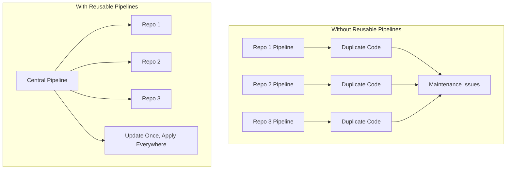

### GitHub Actions: Reusable Workflows

#### 1. **Creating Reusable Workflows**

Reusable workflows allow you to define a workflow once and call it from multiple repositories.

**Central Workflow** (`.github/workflows/reusable-build.yml`):

```yaml
name: Reusable Build Workflow

on:
  workflow_call:
    inputs:
      node-version:
        required: false
        type: string
        default: '18'
      environment:
        required: true
        type: string
    secrets:
      NPM_TOKEN:
        required: true
      DEPLOY_KEY:
        required: false

jobs:
  build-and-test:
    runs-on: ubuntu-latest
    steps:
      - uses: actions/checkout@v4
      
      - name: Setup Node.js
        uses: actions/setup-node@v4
        with:
          node-version: ${{ inputs.node-version }}
          registry-url: 'https://registry.npmjs.org'
      
      - name: Install dependencies
        run: npm ci
        env:
          NODE_AUTH_TOKEN: ${{ secrets.NPM_TOKEN }}
      
      - name: Run tests
        run: npm test
      
      - name: Build application
        run: npm run build
      
      - name: Upload artifacts
        uses: actions/upload-artifact@v3
        with:
          name: build-artifacts
          path: dist/
  
  deploy:
    needs: build-and-test
    runs-on: ubuntu-latest
    if: inputs.environment != 'development'
    steps:
      - name: Download artifacts
        uses: actions/download-artifact@v3
        with:
          name: build-artifacts
      
      - name: Deploy to ${{ inputs.environment }}
        run: |
          echo "Deploying to ${{ inputs.environment }}"
          # Actual deployment logic here
        env:
          DEPLOY_KEY: ${{ secrets.DEPLOY_KEY }}
```

**Calling Workflow** (in each repository):

```yaml
name: CI/CD Pipeline

on:
  push:
    branches: [main, develop]
  pull_request:

jobs:
  development:
    uses: my-org/central-workflows/.github/workflows/reusable-build.yml@v1
    with:
      environment: development
    secrets:
      NPM_TOKEN: ${{ secrets.NPM_TOKEN }}
  
  production:
    if: github.ref == 'refs/heads/main'
    uses: my-org/central-workflows/.github/workflows/reusable-build.yml@v1
    with:
      environment: production
      node-version: '20'
    secrets:
      NPM_TOKEN: ${{ secrets.NPM_TOKEN }}
      DEPLOY_KEY: ${{ secrets.PROD_DEPLOY_KEY }}
```

#### 2. **Composite Actions**

For smaller reusable units, create composite actions:

**action.yml** (in `.github/actions/security-scan`):

```yaml
name: 'Security Scan'
description: 'Run security scans on the codebase'
inputs:
  scan-type:
    description: 'Type of security scan'
    required: false
    default: 'all'

runs:
  using: "composite"
  steps:
    - name: Run dependency check
      shell: bash
      run: |
        npm audit
        
    - name: Run SAST scan
      uses: github/super-linter@v4
      env:
        DEFAULT_BRANCH: main
        GITHUB_TOKEN: ${{ github.token }}
    
    - name: Run secret scanning
      shell: bash
      run: |
        npx secretlint "**/*"
```

#### 3. **Organization-Level Workflows**

Create workflows that automatically run across all repositories in your organization:

```yaml
# In .github/workflows/org-security-scan.yml in your .github repository
name: Organization Security Scan

on:
  schedule:
    - cron: '0 0 * * 0'  # Weekly
  workflow_dispatch:

jobs:
  security-scan:
    runs-on: ubuntu-latest
    steps:
      - name: Run organization-wide security audit
        uses: my-org/security-actions/audit@v1
```

### GitLab CI/CD: Components and Templates

#### 1. **CI/CD Components**

GitLab's CI/CD components are reusable pipeline configuration units:

**Component Definition** (`templates/security/sast.yml`):

```yaml
spec:
  inputs:
    stage:
      default: test
    scanner:
      default: semgrep
    rules:
      default: auto

---
"$[[ inputs.scanner ]]-sast":
  stage: $[[ inputs.stage ]]
  image: returntocorp/semgrep:latest
  script:
    - semgrep --config=$[[ inputs.rules ]] --json --output=sast-report.json .
  artifacts:
    reports:
      sast: sast-report.json
  rules:
    - if: $CI_COMMIT_BRANCH == $CI_DEFAULT_BRANCH
```

**Using the Component**:

```yaml
include:
  - component: gitlab.com/my-org/ci-components/security/sast@v1
    inputs:
      stage: security-test
      scanner: semgrep
      rules: "p/security-audit"

stages:
  - build
  - test
  - security-test
  - deploy
```

#### 2. **Template Repositories**

Create a central repository with pipeline templates:

**Central Template** (`gitlab-ci-templates/node-app.yml`):

```yaml
variables:
  NODE_VERSION: "18"
  DOCKER_DRIVER: overlay2

.node-base:
  image: node:${NODE_VERSION}
  cache:
    key: ${CI_COMMIT_REF_SLUG}
    paths:
      - node_modules/
      - .npm/

.build-template:
  extends: .node-base
  stage: build
  script:
    - npm ci --cache .npm --prefer-offline
    - npm run build
  artifacts:
    paths:
      - dist/
    expire_in: 1 week

.test-template:
  extends: .node-base
  stage: test
  script:
    - npm ci --cache .npm --prefer-offline
    - npm run test:ci
  coverage: '/Coverage: \d+\.\d+%/'

.deploy-template:
  stage: deploy
  image: alpine:latest
  before_script:
    - apk add --no-cache curl
  script:
    - echo "Deploying to ${CI_ENVIRONMENT_NAME}"
    - curl -X POST ${DEPLOY_WEBHOOK_URL}
```

**Project Pipeline** (using templates):

```yaml
include:
  - project: 'my-org/gitlab-ci-templates'
    ref: main
    file: '/node-app.yml'

stages:
  - build
  - test
  - deploy

build:app:
  extends: .build-template
  variables:
    NODE_VERSION: "20"  # Override default

test:unit:
  extends: .test-template
  dependencies:
    - build:app

deploy:staging:
  extends: .deploy-template
  environment:
    name: staging
    url: https://staging.example.com
  only:
    - develop
```

#### 3. **Include and Extends**

Use multiple inclusion strategies:

```yaml
# Include multiple sources
include:
  # Local file
  - local: '.gitlab/ci/build.yml'
  
  # Template from GitLab
  - template: Security/SAST.gitlab-ci.yml
  
  # File from another project
  - project: 'my-org/ci-templates'
    ref: v2.0
    file: '/templates/deploy.yml'
  
  # Remote URL
  - remote: 'https://example.com/ci-templates/test.yml'

# Extend and override
.base-deploy:
  script:
    - echo "Base deployment"
  only:
    - main

deploy-prod:
  extends: .base-deploy
  script:
    - echo "Override base"
    - !reference [.base-deploy, script]  # Include base script
    - echo "Additional production steps"
```

### Comparison: Reusability Features

| Feature | GitHub Actions | GitLab CI/CD |
|---------|---------------|--------------|
| **Reusable Units** | Workflows, Composite Actions | Components, Templates |
| **Sharing Mechanism** | GitHub Marketplace, Org repos | CI/CD Catalog, Include |
| **Parameterization** | Inputs and Secrets | Inputs and Variables |
| **Version Control** | Git tags/branches | Git tags/branches |
| **Discovery** | Marketplace search | CI/CD Catalog |
| **Access Control** | Repository permissions | Project permissions |
| **Testing** | Action testing frameworks | Pipeline testing |

### Best Practices for Reusable Pipelines

#### 1. **Design Principles**

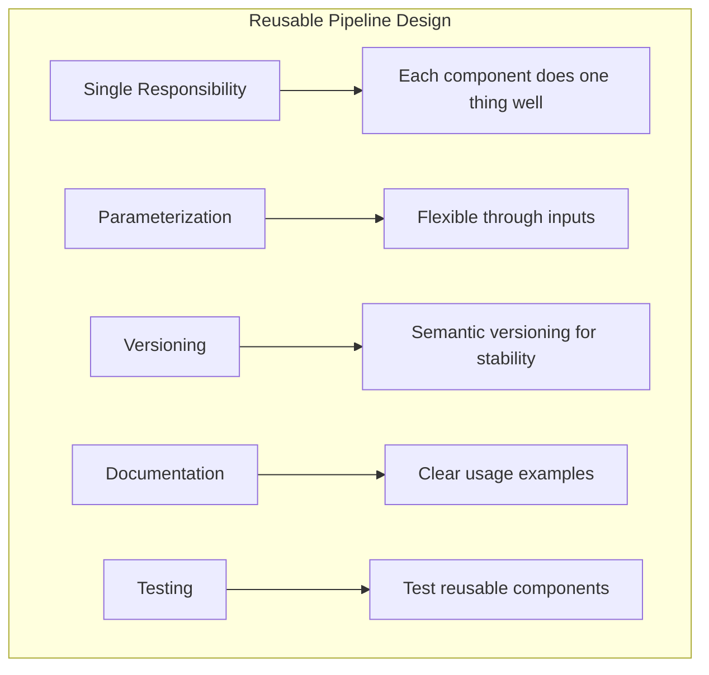

#### 2. **Organization Structure**

```
central-ci/
├── .github/
│   └── workflows/
│       ├── build-node.yml
│       ├── build-python.yml
│       ├── security-scan.yml
│       └── deploy-k8s.yml
├── components/
│   ├── security/
│   ├── quality/
│   └── deployment/
├── docs/
│   └── usage-guide.md
└── examples/
    └── implementation-samples/
```

#### 3. **Implementation Strategy**

1. **Start with Common Patterns**
   - Identify repeated code across pipelines
   - Extract common build/test/deploy steps
   - Create simple reusable components

2. **Gradual Migration**

   ```mermaid
   graph LR
       A[Identify Patterns] --> B[Create Templates]
       B --> C[Test with Pilot Team]
       C --> D[Refine Based on Feedback]
       D --> E[Roll Out Organization-wide]
       E --> F[Continuous Improvement]
   ```

3. **Governance Model**
   - Central team maintains core components
   - Teams can contribute improvements
   - Version control for stability
   - Regular reviews and updates

#### 4. **Security Considerations**

- **Secret Management**: Never hardcode secrets in reusable workflows
- **Access Control**: Limit who can modify central pipelines
- **Audit Trail**: Track usage and changes
- **Compliance**: Ensure reusable components meet security standards

### Real-World Example: Enterprise Pipeline

```yaml
# Central Security-First Pipeline (GitHub Actions)
name: Enterprise Standard Pipeline

on:
  workflow_call:
    inputs:
      app-type:
        type: string
        required: true
      deploy-env:
        type: string
        required: true

jobs:
  compliance-check:
    uses: enterprise/workflows/.github/workflows/compliance.yml@v2
    
  security-scan:
    uses: enterprise/workflows/.github/workflows/security.yml@v2
    with:
      scan-level: ${{ inputs.app-type == 'financial' && 'high' || 'standard' }}
  
  build-and-test:
    needs: [compliance-check]
    uses: enterprise/workflows/.github/workflows/${{ inputs.app-type }}-build.yml@v2
  
  deploy:
    needs: [security-scan, build-and-test]
    uses: enterprise/workflows/.github/workflows/deploy.yml@v2
    with:
      environment: ${{ inputs.deploy-env }}
      approval-required: ${{ inputs.deploy-env == 'production' }}
```

This approach ensures:

- ✅ Consistent security scanning across all apps
- ✅ Compliance checks before any builds
- ✅ Standardized deployment process
- ✅ Easy updates to security policies
- ✅ Reduced maintenance overhead

## 9. Best Practices & Implementation

### CI/CD Best Practices for 2025

#### 1. **Start Small, Scale Gradually**

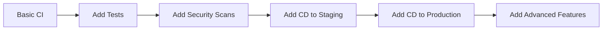

#### 2. **Shift-Left Security**

- Integrate security scanning early
- Use SAST, DAST, and dependency scanning
- Implement policy as code

#### 3. **Optimize Pipeline Performance**

- Use caching effectively
- Parallelize where possible
- Minimize build times
- Use incremental builds

#### 4. **Implement GitOps**

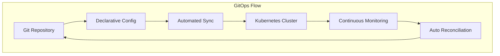

### Implementation Roadmap

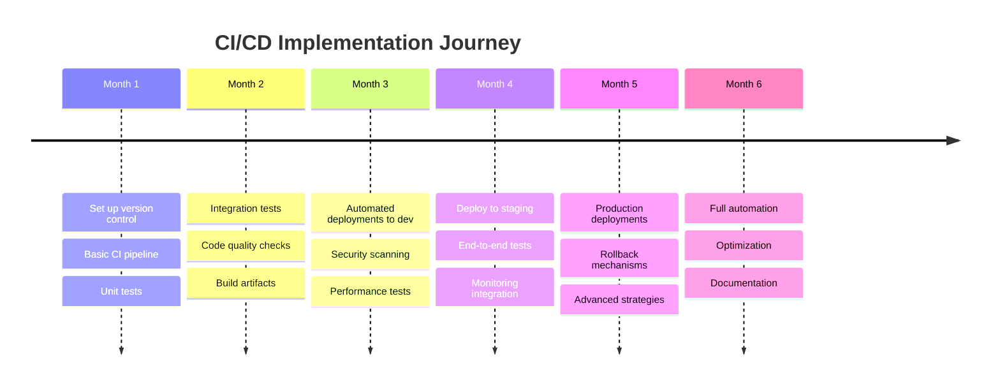

### Common Pitfalls and Solutions

| Pitfall | Impact | Solution |
|---------|--------|----------|
| **Flaky Tests** | False failures | Improve test isolation |
| **Long Build Times** | Slow feedback | Optimize and parallelize |
| **Security as Afterthought** | Vulnerabilities | Shift-left approach |
| **Poor Documentation** | Knowledge silos | Document as code |
| **Manual Processes** | Human errors | Automate everything |

---

## 10. Hands-On Examples

### Example 1: Node.js Application with GitHub Actions

```yaml
name: Node.js CI/CD
on:
  push:
    branches: [ main, develop ]
  pull_request:
    branches: [ main ]

env:
  NODE_VERSION: '18'
  
jobs:
  test:
    runs-on: ubuntu-latest
    strategy:
      matrix:
        node-version: [16, 18, 20]
    
    steps:
    - uses: actions/checkout@v4
    
    - name: Use Node.js ${{ matrix.node-version }}
      uses: actions/setup-node@v4
      with:
        node-version: ${{ matrix.node-version }}
        cache: 'npm'
    
    - name: Install dependencies
      run: npm ci
    
    - name: Run linter
      run: npm run lint
    
    - name: Run tests
      run: npm test -- --coverage
    
    - name: Upload coverage
      uses: codecov/codecov-action@v3
      with:
        file: ./coverage/lcov.info
    
  build:
    needs: test
    runs-on: ubuntu-latest
    
    steps:
    - uses: actions/checkout@v4
    
    - name: Build Docker image
      run: |
        docker build -t myapp:${{ github.sha }} .
        docker tag myapp:${{ github.sha }} myapp:latest
    
    - name: Push to registry
      if: github.ref == 'refs/heads/main'
      run: |
        echo ${{ secrets.DOCKER_PASSWORD }} | docker login -u ${{ secrets.DOCKER_USERNAME }} --password-stdin
        docker push myapp:${{ github.sha }}
        docker push myapp:latest
  
  deploy:
    needs: build
    runs-on: ubuntu-latest
    if: github.ref == 'refs/heads/main'
    
    steps:
    - name: Deploy to Kubernetes
      run: |
        echo "Deploying to production cluster"
        # kubectl commands here
```

### Example 2: Python Application with GitLab CI

```yaml
stages:
  - test
  - build
  - deploy

variables:
  PYTHON_VERSION: "3.10"
  PIP_CACHE_DIR: "$CI_PROJECT_DIR/.cache/pip"

cache:
  paths:
    - .cache/pip
    - venv/

before_script:
  - python -V
  - pip install virtualenv
  - virtualenv venv
  - source venv/bin/activate

test:unit:
  stage: test
  image: python:3.10
  script:
    - pip install -r requirements.txt
    - pip install pytest pytest-cov
    - pytest tests/ --cov=app --cov-report=xml
  coverage: '/TOTAL.*\s+(\d+%)$/'
  artifacts:
    reports:
      coverage_report:
        coverage_format: cobertura
        path: coverage.xml

test:security:
  stage: test
  image: python:3.10
  script:
    - pip install safety bandit
    - safety check
    - bandit -r app/
  allow_failure: true

build:docker:
  stage: build
  image: docker:latest
  services:
    - docker:dind
  script:
    - docker build -t $CI_REGISTRY_IMAGE:$CI_COMMIT_SHA .
    - docker tag $CI_REGISTRY_IMAGE:$CI_COMMIT_SHA $CI_REGISTRY_IMAGE:latest
    - docker login -u $CI_REGISTRY_USER -p $CI_REGISTRY_PASSWORD $CI_REGISTRY
    - docker push $CI_REGISTRY_IMAGE:$CI_COMMIT_SHA
    - docker push $CI_REGISTRY_IMAGE:latest
  only:
    - main

deploy:staging:
  stage: deploy
  image: bitnami/kubectl:latest
  script:
    - kubectl config use-context staging
    - kubectl set image deployment/myapp myapp=$CI_REGISTRY_IMAGE:$CI_COMMIT_SHA
    - kubectl rollout status deployment/myapp
  environment:
    name: staging
    url: https://staging.example.com
  only:
    - develop

deploy:production:
  stage: deploy
  image: bitnami/kubectl:latest
  script:
    - kubectl config use-context production
    - kubectl set image deployment/myapp myapp=$CI_REGISTRY_IMAGE:$CI_COMMIT_SHA
    - kubectl rollout status deployment/myapp
  environment:
    name: production
    url: https://example.com
  when: manual
  only:
    - main
```

### Example 3: Infrastructure Pipeline with Terraform

```yaml
# GitHub Actions for Terraform
name: 'Terraform Infrastructure'

on:
  push:
    branches: [ main ]
    paths:
      - 'terraform/**'
  pull_request:
    paths:
      - 'terraform/**'

env:
  TF_VERSION: '1.5.0'
  AWS_REGION: 'us-east-1'

jobs:
  terraform:
    name: 'Terraform'
    runs-on: ubuntu-latest
    
    defaults:
      run:
        working-directory: ./terraform
    
    steps:
    - name: Checkout
      uses: actions/checkout@v4
    
    - name: Setup Terraform
      uses: hashicorp/setup-terraform@v2
      with:
        terraform_version: ${{ env.TF_VERSION }}
    
    - name: Terraform Format Check
      run: terraform fmt -check -recursive
    
    - name: Terraform Init
      run: terraform init
      env:
        AWS_ACCESS_KEY_ID: ${{ secrets.AWS_ACCESS_KEY_ID }}
        AWS_SECRET_ACCESS_KEY: ${{ secrets.AWS_SECRET_ACCESS_KEY }}
    
    - name: Terraform Validate
      run: terraform validate
    
    - name: Terraform Plan
      run: terraform plan -out=tfplan
      env:
        AWS_ACCESS_KEY_ID: ${{ secrets.AWS_ACCESS_KEY_ID }}
        AWS_SECRET_ACCESS_KEY: ${{ secrets.AWS_SECRET_ACCESS_KEY }}
    
    - name: Terraform Apply
      if: github.ref == 'refs/heads/main' && github.event_name == 'push'
      run: terraform apply -auto-approve tfplan
      env:
        AWS_ACCESS_KEY_ID: ${{ secrets.AWS_ACCESS_KEY_ID }}
        AWS_SECRET_ACCESS_KEY: ${{ secrets.AWS_SECRET_ACCESS_KEY }}
```

---

## 11. Future Trends & Conclusion

### Emerging Trends in CI/CD (2025 and Beyond)

#### 1. **AI-Powered DevOps**

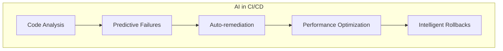

#### 2. **GitOps Everywhere**

- Declarative infrastructure
- Git as single source of truth
- Automated reconciliation

#### 3. **Enhanced Security Integration**

- Zero-trust pipelines
- Supply chain security
- Policy as code enforcement

#### 4. **Edge Computing CI/CD**

- Distributed deployments
- Edge-native testing
- Localized pipelines

### Key Takeaways

1. **CI/CD is Essential**: Modern software development requires automated pipelines
2. **Start Simple**: Begin with basic CI and gradually add complexity
3. **Choose the Right Tool**: GitHub Actions for simplicity, GitLab CI for comprehensive DevOps
4. **Automate Everything**: From testing to infrastructure provisioning
5. **Security First**: Implement security scanning from day one
6. **Continuous Learning**: The field evolves rapidly, stay updated

### Action Items for Your Team

- [ ] Assess current development workflow
- [ ] Choose between GitHub Actions or GitLab CI
- [ ] Start with a simple CI pipeline
- [ ] Add automated tests incrementally
- [ ] Implement security scanning
- [ ] Automate deployments to staging
- [ ] Plan production deployment strategy
- [ ] Document your CI/CD processes
- [ ] Train team members
- [ ] Continuously optimize and improve

### Resources for Further Learning

#### Official Documentation

- [GitHub Actions Documentation](https://docs.github.com/actions)
- [GitLab CI/CD Documentation](https://docs.gitlab.com/ee/ci/)
- [DevOps Practices Guide](https://devops.com)

#### Recommended Books

- "Continuous Delivery" by Jez Humble
- "The DevOps Handbook" by Gene Kim
- "Infrastructure as Code" by Kief Morris

#### Community Resources

- DevOps subreddit
- CNCF DevOps Special Interest Group
- Local DevOps meetups

---

## Conclusion

CI/CD is no longer optional in modern software development—it's essential for staying competitive. Whether you choose GitHub Actions for its simplicity and marketplace ecosystem, or GitLab CI/CD for its comprehensive DevOps platform, the key is to start implementing automation today.

Remember: "CI/CD has revolutionized how software teams create value for their users. Gone are the days of manual deployments and integration headaches — modern development demands automation, reliability, and speed."

The journey to full CI/CD maturity is incremental. Start with continuous integration, add automated testing, then move to continuous delivery, and finally, when ready, embrace continuous deployment. Each step brings value and prepares your team for the next level of automation.

> 💡 **Final Thought**: The best CI/CD pipeline is the one that works for your team and continuously evolves with your needs. Start simple, iterate often, and never stop improving.

---

**Document Version**: 1.0  
**Last Updated**: July 2025  
**Authors**: DevOps Learning Team  
**License**: CC BY-SA 4.0

*This guide is a living document. Contributions and feedback are welcome!*
